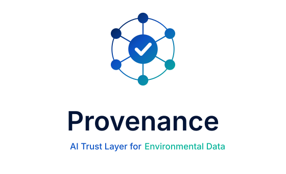

  

# Provenance

**An AI trust layer for environmental sensor networks.**
DEIK.AI Challenge 2026 · entry track 2B · University of Debrecen.

---

149,683 readings over 30 days. Roughly 99.95% complete. By every conventional
measure — uptime, gap counts, last-seen timestamps — Debrecen's Green Sentinel
network is perfectly healthy.

It isn't. A measurable fraction of those readings are silently wrong, and none of
them *look* wrong. That is the entire problem: **a number on a screen looks
exactly the same whether it's true or broken.** A reading of 180 µg/m³ could be a
real pollution event that warrants a public-health warning, or a sensor that has
sat in direct sun with a clogged inlet for six hours. Nothing in the current
pipeline tells a city official which.

Provenance is the layer that does. It scores every reading for genuineness and
explains the reason in language an operator could defend in a council meeting.

## What it does

- **Audits** the corpus for defects that conventional monitoring cannot see —
  absent rows behind a 99.95% completeness figure, frozen sensors, physically
  impossible values, mislabelled units, readings censored at a detection limit.
- **Adjudicates** whether a large event propagated the way real pollutant
  transport would, using a wind-conditioned graph over the station network. This
  is the part that separates a plume from a broken sensor.
- **Deweathers** pollutant series so a spike during a temperature inversion is
  attributed to meteorology rather than flagged as a fault.
- **Explains** every call: reason codes, SHAP attributions, attention-weighted
  neighbours, and a calibrated confidence interval. Never a bare number.

Nothing here auto-publishes a public alert. Every public-facing action passes
through a human sign-off step by design.

## Quick start

Full first-time setup, including Git, is in **[SETUP.md](SETUP.md)**.

    make install        # create .venv and install (uv)
    make hooks          # git pre-commit hooks
    make check          # lint + mypy strict + tests
    make up             # local stack (Postgres + PostGIS)
    prov codes list     # the reason-code registry

## Layout

    src/provenance/     the pipeline: io -> schema -> grid -> detectors -> audit
                        -> trust -> graph -> models -> explain
    apps/web/           React + TypeScript operator dashboard
    tests/              unit · property · integration · e2e · architecture
    infra/              Docker Compose, Dockerfiles, k8s (production path only)
    data/               local only, never committed — see data/README.md
    docs/               ADRs, model cards, API reference, demo materials
    design/             brand assets and design tokens

## Build phases

Each phase is a working system you could present. The statistics-only audit ships
before the graph work on purpose: a slip in the hard weeks should cost ambition,
not viability.

| Phase | Adds | Demo you could give |
|---|---|---|
| 0 | Scaffold, CI, test harness | — |
| 1 | The audit engine | "The network is quietly broken, here is the number" |
| 2 | Storage, Trust Score, API | …plus a live API and a regulator-facing export |
| 3 | Dashboard | A complete product demo |
| 4 | Graph adjudicator | Plume vs broken sensor, with evidence |
| 5 | Deweathering, fault ML, SHAP | The full demo order |
| 6 | HST-GAT, conformal prediction | The research contribution |
| 7 | Alerts, sign-off, hardening | The submission build |

See `CLAUDE.md` for the standing rules that govern all of it.

## Data

The datasets are not in this repository and never will be. `data/README.md`
explains the expected layout and how to profile a new drop.

## Licence

MIT, provisionally — see `LICENSE`.
