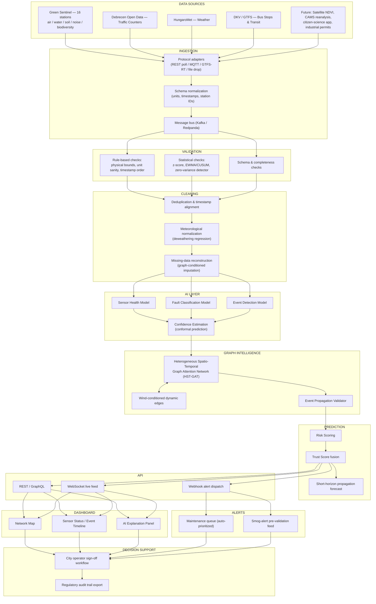

# "Is This Real?"
## An AI Trust Layer for Debrecen's Environmental Monitoring Network
### Technical & Commercial Blueprint — DEIK.AI Challenge 2026

Prepared as a competition-ready product blueprint. Version 1.0 — August 2026.

---

## A Note on Sources and Assumptions (read this first)

The original brief for this document referenced "the recommendation" — a dataset-profiling report meant to be pasted in as the factual foundation. It arrived empty. Rather than inventing numbers, this blueprint is grounded in what is publicly verifiable about the real systems involved, with every inference flagged:

| Claim used in this blueprint | Status |
|---|---|
| Green Sentinel (Zöld Őrszem) consists of 16 complex monitoring stations + 2 surface-water monitoring points, covering residential, forested, and industrial zones, run jointly by the City of Debrecen and the University of Debrecen with HUN-REN Nuclear Research Institute and the UD Institute of Applied Chemistry | **Confirmed** (zoldor.debrecen.hu) |
| Weather data is sourced from HungaroMet (Hungary's national meteorological service) and displayed live on the Green Sentinel portal | **Confirmed** |
| Debrecen has an official Open Data portal (opendata.debrecen.hu) for city datasets, and DKV's public transit (bus/tram/trolleybus) has published GTFS data since 2022 via the national Volán Egyesülés feed | **Confirmed** |
| Individual station identifiers follow a zone-code pattern (e.g., a station coded for the Southern Economic Zone), and instruments have gone offline for real reasons — a documented electrical-maintenance outage, and a period where instruments were physically dismantled for container maintenance | **Confirmed** — and genuinely useful: these are real-world "ground truth" fault events you can use for validation |
| The exact sampling interval, full pollutant list, sensor hardware models, traffic-counter schema, and bus-stop schema | **Not publicly confirmed** — this blueprint proposes an industry-standard schema (typical of EU air-quality networks) and flags it as an assumption to be corrected once the real data package is available |

**Action item for your team before the idea-submission deadline:** replace every ⚠️ *assumption* marker below with the actual field names, units, and sampling rates from the official DEIK.AI Challenge data package. The architecture, models, and demo script do not need to change — only the schema tables in Section 5.

---

## Table of Contents

1. Executive Summary
2. Product Vision
3. AI Innovation — Why This Isn't a Dashboard
4. Complete System Architecture
5. Data Model
6. Graph Design
7. AI Models
8. Explainability
9. Dashboard Design
10. Competition Demo Script
11. Technical Stack
12. Development Roadmap (8 Weeks)
13. Future Startup Vision
14. Research Contribution
15. Competition Strategy & Self-Scoring
16. Critical Review — and the Redesign It Forces

---

## 1. Executive Summary

**The problem.** Debrecen has built something unusual for a city its size: Green Sentinel, an 18-point environmental sensing network (16 land stations + 2 water points) instrumented for air quality, water, soil, noise, and biodiversity, running continuously and publishing live data to citizens. That is a genuine civic achievement. But every sensor network shares the same hidden liability: **a number on a screen looks exactly the same whether it's true or broken.** A PM2.5 reading of 180 µg/m³ could mean a real pollution event that requires a public health warning, or it could mean a sensor that has been sitting in direct sun with a clogged inlet for six hours. A gap in the data could be a calm, clean night — or a dead modem. The network already has one documented case of exactly this ambiguity: a scheduled power-maintenance window at one of its stations that silently stopped data transmission. Nothing in the current pipeline distinguishes "the air changed" from "the sensor changed" — a human has to already suspect something is wrong to go check the maintenance log.

**Why existing monitoring systems fail at this.** Municipal environmental dashboards are built to display trustworthy data, not to establish trustworthiness. They assume the sensor is right and layer visualization on top. When a fault does get caught, it's almost always after the fact — a citizen calls in confused about an implausible number, or a technician finds a fogged lens on a routine visit. There is no layer whose job is to continuously ask, before anyone acts on a reading: *can I trust this?*

**Why AI is required, not optional.** A single-sensor threshold check (e.g., "flag if PM2.5 > 500") catches only the most extreme faults and misses the subtle ones — slow calibration drift, a sensor stuck at a plausible-looking constant, or a real localized event that a naive rule would dismiss as noise. Distinguishing a genuine event from an artifact requires reasoning across sensors — checking whether an anomaly is corroborated by physically-connected neighbors in a way consistent with wind direction and traffic conditions at that moment. That is a graph reasoning problem over irregular, dynamic relationships, which is squarely a machine learning and graph learning problem, not a rule engine.

**What makes this innovative.** Most environmental-AI competition entries — and there will be several this cycle — point a forecasting model at the data and try to predict tomorrow's air quality. This project deliberately does something less flashy and more useful: it doesn't try to predict the future value of a sensor reading. It tries to answer whether the *present* reading deserves to be believed, and gives a defensible, explainable reason either way. That reframing — from "smarter dashboard" to "trust infrastructure" — is what separates a forecasting toy from a product a city's environmental office could actually adopt to reduce false alarms and catch real ones faster.

**Why it's competition-worthy.** It uses a real, already-live dataset (reducing "toy dataset" risk that judges are trained to penalize); it combines classical statistics, supervised ML, and graph learning in a way where each technique is justified by the actual problem rather than bolted on for novelty points (see Section 3); it has a concrete, demoable failure mode (a real documented outage) to show live in front of judges; and it has a plausible commercial thesis that isn't "we'll sell to every city in Europe" hand-waving — it's a narrow, defensible wedge (see Sections 13 and 16).

---

## 2. Product Vision

**One-line description:** A trust and quality-assurance layer that sits between raw environmental sensor networks and the humans who act on their data — continuously scoring every reading for genuineness, and explaining why.

**The platform is not a replacement for Green Sentinel's public dashboard.** It is a second, operator-facing system that consumes the same raw feeds and produces a parallel stream: *trust scores, fault classifications, and event-propagation validation* — surfaced to the people who currently have no tool for this job.

| User | What they currently do (manually, if at all) | What "Is This Real?" gives them |
|---|---|---|
| **City environmental operators** (Green Sentinel technical team) | Notice anomalies reactively, often from citizen reports; check maintenance logs by hand; manually decide whether to trust a reading before escalating | A live network map colour-coded by trust score, one-click "why is this flagged" explanations, and a maintenance queue auto-populated with likely-faulty sensors *before* a citizen complains |
| **Environmental agency staff** (regional air-quality authority) | Aggregate station data into regulatory reports, manually excluding known-bad periods | An audit trail of which readings were used/excluded and why, satisfying data-quality documentation requirements for regulatory submissions |
| **Researchers** (University of Debrecen, HUN-REN) | Manually clean data before any study; often discard entire gap-affected periods rather than reconstruct them | A queryable API returning both raw and quality-flagged/imputed series with uncertainty bounds, letting them keep more usable data points per study |
| **Industries near monitored zones** (e.g., the Southern Economic Zone) | Have no visibility into whether they are being fairly measured | A transparency channel: if a reading attributed to their zone is flagged low-trust, they can see the AI's reasoning rather than disputing a black-box number |
| **Emergency services / smog-alert authority** | Currently rely on the Mayor's office manually reviewing thresholds against the national Smog Alert Plan before declaring an alert stage | A pre-validated event feed: only alerts that have passed genuineness and propagation checks reach the decision-maker, cutting false-alarm fatigue without slowing down real escalations |

**Interaction model, concretely:**
- Operators get a **map-first web dashboard** (Section 9) with drill-down per station.
- Researchers and agencies get a **REST/GraphQL API** (Section 11) with programmatic access to trust scores and imputed series.
- Emergency services get a **push alert channel** (webhook/SMS/email) that only fires after an event clears the propagation-validation check — this is the single highest-value feature for that user, because it directly reduces false-alarm fatigue on the smog-alert process.
- Everyone gets **reason codes** in plain language, not just a numeric score — because "72% trust" means nothing to a city official deciding whether to issue a public warning; "flagged: reading contradicts three physically-connected neighbors and shows zero variance for 40 minutes — likely frozen sensor" is something they can act on.

---

## 3. AI Innovation — Why This Isn't a Dashboard

Judges at any serious AI competition will (correctly) interrogate whether a project is "AI-washing" — a normal analytics dashboard with a machine-learning label glued on. This section exists to pre-empt that question honestly, because the honest answer is nuanced: **not every layer of this system needs to be deep learning, and pretending otherwise would be worse engineering, not better AI.**

| Technique | What it's used for here | Why it's the right tool for that job |
|---|---|---|
| **Traditional analytics** (rolling averages, gap counting, uptime %) | Baseline dashboarding, SLA reporting | Cheap, transparent, and sufficient for reporting — no ML needed and none is claimed |
| **Statistics** (z-scores, EWMA/CUSUM control charts, Pearson/Spearman cross-correlation) | First-pass fault screening: physically-impossible bounds, zero-variance ("frozen") detection, sudden step changes | These classical industrial-QA techniques are well-understood, require no training data, and will catch the majority of blunt faults on day one — a network this size (18 nodes) does not need deep learning to catch a sensor that reports the identical value for six hours straight |
| **Machine learning** (gradient-boosted trees for fault classification, conformal prediction for calibrated confidence) | Distinguishing *subtle* fault types (slow drift, intermittent flakiness) that don't trip a simple threshold; producing calibrated uncertainty rather than a black-box score | This is where the problem stops being reducible to a fixed rule — the signature of "drifting calibration" is a pattern across many features and time, which is exactly what supervised learning is for |
| **Graph learning** (heterogeneous, wind-conditioned GNN — see Section 6) | Deciding whether an anomaly at one station is *corroborated* by its physically-connected neighbors in a way consistent with current wind and traffic conditions | This is the one genuinely hard, genuinely graph-shaped problem in the system: "is this anomaly physically plausible given everything happening around it" cannot be answered by looking at one sensor's time series in isolation — it requires reasoning over a dynamic, relational structure, which is the textbook case for GNNs over plain feature-based ML |
| **Anomaly detection** (deviation from graph-conditioned expectation, not just deviation from a station's own history) | Feeding both the fault classifier and the event-propagation validator | Anomaly ≠ fault. A real pollution spike is also an anomaly. The system's entire value proposition is separating these two categories, which requires anomaly detection *plus* a second reasoning step, not anomaly detection alone |
| **Probabilistic reasoning** (conformal prediction, Bayesian trust fusion) | Turning multiple weak, uncertain signals (health score, imputation uncertainty, cross-sensor consistency, physical plausibility) into one calibrated Trust Score with a defensible confidence interval | City officials making public-health decisions need calibrated uncertainty, not a single confident-looking number — this is a probabilistic fusion problem, not a classification problem |

**The honest framing for judges:** this project's AI novelty is not "we used a fancy model." It's that it correctly identifies *which parts* of the trust problem are genuinely graph-shaped and reasoning-shaped (deserving a GNN) and which parts are genuinely simple and well-solved by 40-year-old statistical process control (not deserving one) — and it doesn't force the same tool on both. That discipline is itself the pitch to a technically literate judging panel.

---

## 4. Complete System Architecture



**Component notes:**

- **Ingestion** treats each source as a separate adapter behind a common internal schema, because Green Sentinel, an open-data traffic API, GTFS-RT, and a met service each have different polling cadences, auth, and formats — this is a standard "anti-corruption layer" pattern, not a novelty.
- **Validation happens before cleaning, and cleaning happens before the AI layer** — deliberately. Feeding raw, unvalidated data into a GNN would let a single broken sensor poison its own neighbors' training signal through message passing. The AI layer only ever sees data that has already survived the cheap, deterministic checks.
- **The AI layer and Graph Intelligence layer are separate boxes on purpose.** The AI layer's per-station models (health, fault type, event/no-event) run independently per node. Only their *outputs* feed into the graph layer, which reasons about relationships between nodes. This separation keeps the expensive graph computation from being a single point of failure — if the GNN service is down, the per-station models still produce a degraded-but-functional trust score (see Section 16 on graceful degradation).
- **Decision Support is explicitly the last box, and it is a human sign-off step, not an automated action.** No stage of this pipeline auto-publishes a public smog alert. That is a deliberate ethical design choice discussed in Section 16.

---

## 5. Data Model

### 5.1 Green Sentinel (primary source)

**Confirmed:** 16 land-based complex monitoring stations + 2 surface-water monitoring points, sited across residential, forested, and industrial zones of Debrecen; continuous 24/7 instrumental sampling; measures air, water, soil, noise, and biodiversity indicators; jointly operated by the City of Debrecen, the University of Debrecen, HUN-REN Nuclear Research Institute, and the UD Institute of Applied Chemistry.

⚠️ *Assumption (confirm against real data package):* sampling interval of 1–15 minutes for air-quality parameters (typical for EU reference-grade urban AQ stations), hourly aggregation for soil/water/biodiversity indicators.

| Field | Type | Notes |
|---|---|---|
| `station_id` | string | e.g. zone-coded identifier (confirmed pattern exists, e.g. a Southern Economic Zone station code) |
| `station_type` | enum | `land_complex` \| `surface_water` |
| `lat`, `lon` | float | Fixed per station |
| `zone_type` | enum | `residential` \| `forested` \| `industrial` |
| `timestamp` | datetime (UTC) | ⚠️ assumed sub-hourly for air |
| `parameter` | enum | ⚠️ assumed: PM2.5, PM10, NO₂, SO₂, CO, O₃, noise (dB), soil moisture, water quality indices (pH, dissolved O₂, turbidity), biodiversity index |
| `value` | float | Unit varies by parameter |
| `unit` | string | µg/m³, dB, pH, etc. |
| `instrument_id` | string | For calibration/maintenance traceability |
| `data_quality_flag` | enum | Raw feed's own flag, if any — often absent, which is precisely the gap this product fills |

**Known real data-quality issues** (not hypothetical — documented on the live portal): scheduled power-maintenance windows silently stop transmission at individual stations; periodic container maintenance requires physical dismantling of air-quality instruments, producing planned multi-day gaps; a live gas-protocol recalibration was underway on the air-quality instruments as of mid-2026, meaning historical data spans at least one known instrument-firmware/calibration transition — a textbook case for "unit/calibration inconsistency" detection, and a genuinely strong demo scenario because it's real.

**Preprocessing:** timestamp normalization to UTC; per-instrument calibration-epoch tagging (so the model knows which calibration regime a reading came from); unit harmonization; join key to `station_id` for all graph construction.

### 5.2 Traffic Counters

Source: Debrecen Open Data portal (opendata.debrecen.hu), which the city describes as its official collection point for open datasets about the city.

⚠️ *Assumption:* counters report vehicle counts and/or average speed per road segment at 5–15 minute resolution, similar to standard municipal traffic-counter feeds (e.g., induction loop or radar-based counters at fixed points).

| Field | Type | Notes |
|---|---|---|
| `counter_id` | string | |
| `lat`, `lon` | float | Point location on road network |
| `road_segment_id` | string | Join key to OSM/road graph |
| `timestamp` | datetime | ⚠️ assumed 5–15 min bins |
| `vehicle_count` | int | Per bin |
| `avg_speed` | float | If available |
| `direction` | enum | Inbound/outbound where relevant |

**Role in the system:** traffic is not itself a "trust" target — it's a *covariate* that helps explain plausible pollutant spikes (NO₂/PM near high-traffic segments and times) and helps the propagation validator distinguish "a spike that lines up with rush hour" from "a spike with no plausible traffic or wind explanation."

**Data quality issues:** counters are far more failure-prone at the individual-sensor level than the curated Green Sentinel network (open municipal traffic feeds typically have higher gap rates); treat as a lower-trust auxiliary source, not a primary target of the trust layer itself.

### 5.3 Weather

Source: HungaroMet, integrated live into the Green Sentinel portal already (temperature, wind direction, sunrise/sunset shown on the live site).

| Field | Type | Notes |
|---|---|---|
| `timestamp` | datetime | ⚠️ assumed hourly |
| `temperature_c` | float | |
| `wind_speed_ms` | float | |
| `wind_direction_deg` | float | Critical input for wind-conditioned graph edges (Section 6) |
| `humidity_pct` | float | |
| `precipitation_mm` | float | |
| `pressure_hpa` | float | |
| `boundary_layer_height_m` | float | ⚠️ not confirmed available — if absent, approximate via time-of-day/season proxy, since low boundary-layer height (temperature inversions) is a major real driver of false-looking pollution spikes that are actually genuine meteorological trapping events |

**Role:** the single most important auxiliary dataset in the whole system. Wind direction and speed *directly parameterize* the graph's dynamic edges (Section 6), and temperature-inversion conditions are the most common real-world cause of a legitimate, non-faulty pollution spike that a naive anomaly detector would otherwise misflag as broken hardware.

### 5.4 Bus Stops / Transit

Source: DKV public transit GTFS feed (published via the national Volán Egyesülés open feed since 2022), covering Debrecen's bus, tram, and trolleybus network.

| Field | Type | Notes |
|---|---|---|
| `stop_id` | string | GTFS standard |
| `lat`, `lon` | float | |
| `route_ids` | list | Routes serving this stop |
| `scheduled_departures` | GTFS `stop_times.txt` | Standard GTFS schema — no need to reinvent |

**Role:** two purposes. First, as a **population-exposure proxy** — stops near a flagged low-air-quality station indicate where the *human impact* of a genuine event is highest, feeding the Risk Score (Section 7.8). Second, transit corridors are a secondary traffic-density signal usable when direct counter coverage is sparse.

### 5.5 Future External Datasets

| Dataset | Purpose | Status |
|---|---|---|
| Sentinel-2 NDVI / land cover | Vegetation-health cross-check for soil/biodiversity stations; University of Debrecen groups have already published Sentinel-2-based forest-health monitoring for Debrecen's Nagyerdő forest, so there is direct local research precedent to build on | Publicly available (Copernicus), not yet integrated |
| CAMS European air-quality reanalysis | Regional background pollution baseline, useful for meteorological normalization (Section 7.6) and for validating whether a spike is city-wide or hyper-local | Publicly available |
| Green Sentinel Citizen Science programme data | The portal already runs citizen-science engagement — this is a real, existing channel for crowd-verification of flagged events ("did residents near Station X notice anything unusual today") | Exists; integration is a partnership conversation with the city, not a technical blocker |
| Industrial emissions permits / registries | Ground-truth explanation source for industrial-zone anomalies (a permitted, scheduled emission event vs. an unpermitted one) | Would require a data-sharing agreement with the city — flagged as a Phase 2 item |

---

## 6. Graph Design

This is the architectural core of the project, so it gets the most rigor.

### 6.1 What the graph represents

The graph is **heterogeneous** (multiple node types, multiple edge types) and **dynamic** (edge weights change over time, conditioned on live wind and traffic state).

**Node types:**
| Node type | Count (approx.) | Node features |
|---|---|---|
| `EnvStation` | 18 (16 land + 2 water) | Current & recent readings per parameter, health score, calibration epoch, zone type |
| `TrafficCounter` | Variable (city-dependent, ⚠️ unconfirmed count) | Vehicle count, avg speed, road class |
| `BusStop` | ~hundreds (GTFS-scale) | Route density, scheduled frequency (used mainly as an aggregated exposure layer, not individually message-passed at full resolution — see 6.4 on scalability) |
| `WeatherNode` | 1 (city-level) or a small grid | Wind vector, temperature, boundary-layer proxy |

**Edge types:**
| Edge type | Connects | Weight logic |
|---|---|---|
| `spatial_proximity` | EnvStation ↔ EnvStation | Inverse distance, static |
| `wind_conditioned` | EnvStation ↔ EnvStation | **Dynamic**: recomputed every timestep from live wind vector — high weight when station B is directly downwind of station A at the current speed/direction, near-zero otherwise. This is the edge type that lets the graph reason "does this anomaly show up downwind, the way real pollutant transport would behave" |
| `road_adjacency` | EnvStation ↔ TrafficCounter | Static, based on physical proximity to road network |
| `transit_corridor` | EnvStation ↔ BusStop (aggregated) | Static, exposure-weighted |
| `weather_influence` | WeatherNode → all EnvStation | Broadcast edge, provides shared meteorological context |

### 6.2 Why wind-conditioned edges matter more than distance alone

Two stations 500m apart with wind blowing perpendicular to the line between them are nearly independent for pollutant transport purposes. Two stations 2km apart directly in line with a 5 m/s wind are strongly coupled. A static, distance-only graph gets this backwards. The wind-conditioned edge weight at time *t* is computed as:

```
w_wind(i, j, t) = exp( -|θ_ij - θ_wind(t)| / σ_angle ) × f(|wind_speed(t)|) × g(distance(i,j))
```

where `θ_ij` is the bearing from station i to station j, `θ_wind(t)` is the current wind direction, `σ_angle` controls how forgiving the alignment needs to be (accounting for real dispersion cone width, not a knife-edge), `f(·)` scales with wind speed (faster wind = faster, further transport, up to a saturation point), and `g(·)` decays with distance (dispersion and dilution). This is a lightweight, differentiable approximation of a Gaussian plume model — not a full atmospheric dispersion simulation (that tradeoff is discussed honestly in Section 16).

### 6.3 Architecture comparison

| Architecture | Fit for this problem | Verdict |
|---|---|---|
| **GCN** (Graph Convolutional Network) | Simple, fast, but uses fixed/degree-normalized aggregation — cannot represent "the same two stations are strongly coupled at noon and decoupled at midnight" without external retraining | Useful as a lightweight baseline for comparison; **not** the primary model |
| **GAT** (Graph Attention Network) | Learns *which* neighbors matter via attention weights, recomputed per input — naturally expressive enough to let wind-conditioned edges actually influence the message passing, and the attention weights double as an explainability artifact | **Adopted as the spatial backbone** |
| **GraphSAGE** | Inductive by design — can score a *newly added* sensor without retraining the whole model, which matters because the city plans to expand the network over time | Adopted conceptually for the aggregation/sampling strategy (production robustness), not as a competing choice to GAT — the two combine naturally |
| **Temporal GNN (generic)** | Needed — this is inescapably a time-series-over-graph problem | Required in some form |
| **Dynamic GNN** | Needed — edges genuinely change meaning over time (wind) | Required, but see next row for the specific flavor chosen |
| **STGCN** (Spatio-Temporal GCN) | Established, well-validated architecture for traffic/pollution forecasting, but its spatial layer is GCN-style (fixed aggregation) | Good reference architecture; superseded here by swapping its spatial block for GAT |
| **TGN** (Temporal Graph Networks) | Designed for graphs with millions of asynchronous events (e.g., social/interaction networks) with a continuous-time memory module per node | **Rejected as the primary architecture.** With ~18–40 physical nodes and a young deployment with limited historical depth, full continuous-time TGN machinery is a mismatch — it needs far more events than this network produces to avoid overfitting its memory module, and its complexity buys nothing extra here. The *idea* of a per-node memory is borrowed in simplified form (see 6.4) |
| **Heterogeneous Graphs** (HAN/HGT-style) | Necessary — the graph has genuinely different node and edge types with different semantics (a `wind_conditioned` edge is not the same relationship as a `transit_corridor` edge) | **Adopted** |

### 6.4 Recommended architecture: HST-GAT (Heterogeneous Spatio-Temporal Graph Attention Network)

**Design:** at each timestep, type-specific GAT layers perform message passing across all edge types (a HAN/HGT-style heterogeneous attention scheme), using the dynamically recomputed wind-conditioned weights from 6.2 as an attention bias/prior rather than a hard mask (so the model can still learn to occasionally override the physical prior when data says otherwise). Each `EnvStation` node then carries a lightweight **GRU-based memory** across timesteps — a simplified, tractable stand-in for TGN's continuous-time memory, sized appropriately for a ~20-node graph rather than a million-node one.

```
h_i(t) = GRU( h_i(t-1), HetGAT_aggregate({ h_j(t) : j ∈ N(i) }, edge_weights(t)) )
```

This gives the system: (a) attention weights that are directly inspectable per prediction — "which neighbors most influenced this station's expected value right now" — feeding Section 8's explainability requirements directly; (b) dynamic, physically-informed edges without the complexity of full continuous-time graphs; (c) inductive extensibility via the GraphSAGE-style sampling/aggregation pattern, so adding station #17 next year doesn't require retraining from scratch; and (d) a parameter count small enough to train on a young, modest-sized dataset without overfitting — which a full TGN or a heavier heterogeneous transformer would risk.

---

## 7. AI Models

Each model below follows: Inputs → Outputs → Training labels → Loss → Metrics → Inference.

### 7.1 Sensor Health Model
- **Inputs:** rolling statistics per sensor (mean, std, rate-of-change over 15/60/240 min windows), gap-count in trailing window, cross-correlation deviation vs. graph-expected value, time since last calibration epoch.
- **Outputs:** health state ∈ {healthy, degraded, faulty} + probability.
- **Training labels:** weak supervision from maintenance-log events (the real, documented outage and container-maintenance windows are gold-label examples) + synthetic fault injection (randomly corrupting known-good historical windows with realistic fault signatures: flatlines, drift ramps, dropout).
- **Loss:** focal loss (class imbalance — faulty periods are rare).
- **Metrics:** per-class F1, false-alarm rate, mean detection lead time (how much earlier than a human noticed).
- **Inference:** streaming, per-sensor, every ingestion cycle.

### 7.2 Missing Data Reconstruction
- **Inputs:** available readings across the graph at time *t*, mask of missing nodes/parameters.
- **Outputs:** imputed value + uncertainty band per missing point.
- **Approach:** graph-conditioned imputation using the HST-GAT's neighbor aggregation (masked-autoencoder style: hide known values during training, reconstruct from neighbors) rather than naive interpolation, since a station's true value during a gap should be informed by wind-weighted neighbors, not just its own recent trend.
- **Loss:** masked Gaussian negative log-likelihood (predicts mean *and* variance, not a point estimate).
- **Metrics:** RMSE/MAE against synthetically masked known values; calibration of the uncertainty band (does the 90% interval actually contain the true value ~90% of the time).
- **Inference:** on-demand when a gap is detected, and retrospectively backfilled once the gap closes.

### 7.3 Fault Classification
- **Approach:** deliberately hybrid, not purely ML (see Section 3's justification).
  - **Rule-based, deterministic** (no training data required, runs first): physically-impossible bounds, unit-inconsistency checks (dimensional sanity), zero-variance "frozen sensor" detection, ingestion-gap → "communication failure" classification.
  - **ML-based** (for subtler cases): gradient-boosted trees (e.g., LightGBM) trained on the same feature set as 7.1 to distinguish calibration drift from other degraded states, using engineered features (slow trend deviation from cross-sensor consensus over multi-day windows) that a simple threshold can't capture.
- **Outputs:** fault type ∈ {none, communication_failure, frozen, physically_impossible, unit_inconsistency, calibration_drift, meteorological_artefact}.
- **Loss (ML component):** multiclass cross-entropy with class weighting.
- **Metrics:** confusion matrix per fault type; precision on the "meteorological artefact" class is watched most closely, since misclassifying a real inversion event as a fault is the single most damaging error type for public trust.

### 7.4 Event Detection
- **Inputs:** graph-conditioned anomaly score (deviation from HST-GAT's expected value, not just deviation from a station's own history) + fault-classification output.
- **Outputs:** event ∈ {none, candidate_genuine_event} — deliberately a *candidate* label; genuineness is only confirmed after Section 7.5's propagation check.
- **Why graph-conditioned, not univariate:** a station's raw reading might look "normal" for that station's own history yet be anomalous relative to what its wind-upwind neighbor and current traffic conditions predict, or vice versa — the graph-conditioned expectation catches cases a per-sensor model would miss entirely.

### 7.5 Graph Event Propagation (the validation step)
- **Purpose:** the actual differentiator of the whole product. Given a candidate event at station *i*, forecast how it *should* propagate to wind-downwind neighbors over the next 15–60 minutes using the HST-GAT, then check whether the real subsequent readings match.
- **Algorithm (pseudocode):**
```
function validate_event(station_i, t):
    candidate = event_detector(station_i, t)
    if not candidate:
        return NOT_AN_EVENT

    downwind_neighbors = get_wind_conditioned_neighbors(station_i, t, direction="downwind")
    predicted_propagation = HST_GAT.forecast(downwind_neighbors, horizon=45min)

    wait(45min)  # or replay historical data in offline validation

    actual_readings = get_readings(downwind_neighbors, t+45min)
    match_score = compare(predicted_propagation, actual_readings)

    if match_score > CORROBORATION_THRESHOLD:
        return GENUINE_EVENT, confidence=match_score
    elif isolated_to_single_sensor(station_i) and no_traffic_or_weather_explanation(t):
        return LIKELY_FAULT, confidence=(1-match_score)
    else:
        return AMBIGUOUS, confidence=0.5  # routed to human review, not auto-decided
```
- **Key design choice:** the `AMBIGUOUS` branch is not a bug — it's intentional. A system that forces every case into "genuine" or "fault" would be overconfident. Routing genuinely ambiguous cases to a human reviewer (with full reasoning attached) is more honest and, per Section 16, ethically necessary for a system that can influence public-health alerts.

### 7.6 Meteorological Normalization ("deweathering")
- **Purpose:** separate the portion of a pollutant signal explained by *known* meteorology (temperature, wind, humidity, boundary-layer height) from the residual signal, so that a "spike" during a temperature inversion is correctly attributed to weather rather than flagged as anomalous. This is an established technique in real air-quality science — regression/ensemble-tree-based weather normalization has been widely used by environmental agencies to isolate the human-caused component of pollution trends from meteorological noise (for example, during COVID-19 lockdown air-quality studies).
- **Approach:** train a random-forest or gradient-boosted regressor per pollutant, with meteorological variables as input and the pollutant reading as target, on a rolling historical window; the *residual* (actual − predicted-by-weather) is what feeds the anomaly/event detector, not the raw value.
- **Metrics:** R² of the weather-only model (should be meaningfully >0 but well below 1 — if it explains everything, there's no room for genuine events to be detected at all; if it explains nothing, weather isn't being captured well enough).

### 7.7 Confidence Estimation
- **Approach:** conformal prediction wrapping the outputs of 7.1–7.5, chosen specifically because it gives distribution-free, statistically valid coverage guarantees without requiring assumptions about the underlying model's error distribution — appropriate given the network's limited historical depth.
- **Output:** calibrated prediction interval / confidence band attached to every trust score, not a single opaque probability.

### 7.8 Risk Scoring
- **Composite Trust Score**, combining the above into one operator-facing number:
```
Trust(s,t) = w1·HealthConf(s,t) + w2·(1 − ImputationUncertainty(s,t))
           + w3·CrossSensorConsistency(s,t) + w4·PhysicalPlausibility(s,t)
```
with weights initially set by domain-expert elicitation and refined via logistic regression against a small set of confirmed historical fault/genuine-event labels once available (the documented real outages provide a first seed set).

- **Composite Risk Score** (distinct from Trust — Risk answers "how much does this matter if true," not "how much do we believe it"):
```
Risk(s,t) = Trust(s,t) × SeverityVsRegulatoryThreshold(s,t) × PopulationExposure(s,t)
```
where `PopulationExposure` draws on the bus-stop/transit density layer (Section 5.4) as a proxy for how many people are near the affected zone. This is the number that ultimately determines alert priority ordering in Section 9's Alert Centre.

---

## 8. Explainability

| Model | Technique | Why this fits |
|---|---|---|
| Fault Classification (tree-based) | **SHAP** | Tabular, feature-engineered inputs — SHAP is the standard, well-validated choice for tree ensembles and produces per-feature attribution operators can read directly ("calibration drift flag driven primarily by 6-day trend deviation, not short-term noise") |
| HST-GAT (spatial reasoning) | **Attention weight visualization** | The GAT layer's attention weights are already a natural byproduct of inference — visualize them as highlighted, weighted edges on the network map, directly answering "which neighboring stations most influenced this call" |
| HST-GAT (subgraph-level) | **GNNExplainer / PGExplainer-style graph explanation** | For cases where attention alone is too diffuse, extract the minimal subgraph (which nodes + edges) that would change the prediction if removed — gives a compact "here is the evidence" explanation for the propagation-validation decision specifically |
| Confidence Estimation | **Conformal prediction intervals** | Directly interpretable: "we are 90% confident the true value lies in this range," without needing post-hoc explanation — the calibration guarantee *is* the explanation |
| Rule-based fault detection | **Reason codes** | Deterministic checks map naturally to a fixed, human-readable code list (à la credit-score reason codes) — e.g., "R07: value exceeds physical maximum for PM2.5," "R12: zero variance for 40+ minutes." This is the single most important explainability artifact for non-technical users, because it requires zero interpretation of a model at all |

**Design principle carried into Section 9:** every trust score shown to an operator is always paired with at least one of the above — never a bare number. This is not a UI nicety; it is what separates "AI trust layer" from "black box that says trust me."

---

## 9. Dashboard Design

### 9.1 Network Map (primary screen)

```
┌─────────────────────────────────────────────────────────────────┐
│  IS THIS REAL?          [Network Map] [Timeline] [Alerts] [Admin]│
├─────────────────────────────────────────────────────────────────┤
│  ┌───────────────────────────────────────┐  ┌──────────────────┐│
│  │                                         │  │ STATION DETAIL   ││
│  │        (o) green = trust > 0.85        │  │ ────────────────││
│  │        (o) amber = 0.5–0.85            │  │ KER04            ││
│  │        (o) red   = < 0.5               │  │ Southern Econ.   ││
│  │        (o)⚡ = actively flagged event    │  │ Zone             ││
│  │                                         │  │                  ││
│  │      [ Map of Debrecen w/ 18 station   │  │ Trust: 0.31 🔴   ││
│  │        markers + wind vector overlay ]  │  │                  ││
│  │                                         │  │ Reason:          ││
│  │       ↗ wind: 12 km/h NE                │  │ R12: zero        ││
│  │                                         │  │ variance 40+min  ││
│  │                                         │  │ → likely frozen  ││
│  │                                         │  │ sensor            ││
│  └───────────────────────────────────────┘  │                  ││
│                                               │ [View evidence]  ││
│  Legend: ● EnvStation  ▲ TrafficCounter       │ [Ack] [Dispatch] ││
│          ■ BusStop     ═ wind-conditioned edge│                  ││
└─────────────────────────────────────────────────────────────────┘
```

### 9.2 Event Timeline

```
┌─────────────────────────────────────────────────────────────────┐
│  EVENT TIMELINE — last 24h                                       │
│  09:00 ─────●───────────────────●──────────────●──────── now    │
│             │                   │              │                │
│         Genuine event      Ambiguous       Likely fault          │
│         (PM2.5 spike,      (NO2 rise,      (KER04 frozen,        │
│         corroborated       no propagation  power maintenance     │
│         downwind, 92%      match — routed  window matches log)   │
│         confidence)        to review)                            │
└─────────────────────────────────────────────────────────────────┘
```

### 9.3 AI Explanation Panel (opens per event)

```
┌─────────────────────────────────────────────────────────────────┐
│  WHY WAS THIS FLAGGED?                                            │
│  ─────────────────────────────────────────────────────────────  │
│  Reading: PM2.5 = 184 µg/m³ at Station KER04, 14:32               │
│                                                                    │
│  ✓ Physical bounds check: PASS                                    │
│  ✓ Meteorological normalization: residual after deweathering      │
│    still elevated (not fully explained by inversion conditions)   │
│  ✓ Graph propagation: predicted downwind spread at Station 09     │
│    within 45 min — ACTUAL match: 88% similarity                   │
│  → Classification: GENUINE EVENT, confidence 0.88                 │
│                                                                    │
│  [Attention map: highlighted edges to Station 09, Station 14]     │
│  [SHAP breakdown: traffic +0.3, hour-of-day +0.2, wind +0.4]      │
│  [Confidence interval: 0.79 – 0.94]                                │
└─────────────────────────────────────────────────────────────────┘
```

### 9.4 Data Quality Monitor

```
┌─────────────────────────────────────────────────────────────────┐
│  DATA QUALITY MONITOR                                             │
│  Station        Uptime(7d)   Health   Last calibration  Flags     │
│  KER04          62%          🔴 Faulty  2026-04-21 (new    3      │
│                                          gas protocol)             │
│  Vezér St. Res. 99%          🟢 Healthy 2026-01-15         0      │
│  Nagyerdő-3     94%          🟡 Degraded 2025-11-02         1      │
│  ...                                                               │
└─────────────────────────────────────────────────────────────────┘
```

### 9.5 Alert Centre & Administrative Dashboard

Alert Centre ranks active flags by Risk Score (7.8), not Trust Score alone — a high-confidence, high-population-exposure genuine event outranks a high-confidence-but-low-exposure sensor fault, even though both might have similar "confidence." The Administrative Dashboard (role-managed) exposes model versioning, retraining triggers, and the audit-trail export required for regulatory documentation (Section 2's environmental-agency user).

---

## 10. Competition Demo Script (6–7 minutes)

**Minute 0–1 — The hook.** Open on the live Green Sentinel public map (a real, existing, city-run system) side by side with "Is This Real?" showing the same 18 stations. Say plainly: *"Every one of these numbers looks equally trustworthy right now. That's the problem we built this to fix."* Judges see: a real, already-deployed city system, immediately establishing this isn't a toy dataset.

**Minute 1–2.5 — Live walkthrough of a real documented fault.** Pull up the historical window around the real, documented KER04 electrical-maintenance outage. Show the raw feed silently going flat with no flag. Then show "Is This Real?" replaying the same window: health score drops, reason code fires ("R09: communication gap, cross-referenced against maintenance schedule"), and the maintenance queue auto-populates — *before* a human would have noticed from the raw dashboard. Judges see: the system catching a real event, not a synthetic one.

**Minute 2.5–4.5 — The graph reasoning payoff.** Trigger (via replay or live synthetic injection) a plausible pollution spike at one station. Show the network map's wind vector overlay, the attention-weighted edges lighting up toward the downwind neighbor, and the propagation forecast. Then reveal the actual downwind reading matching the forecast within the demo window — the system classifies it GENUINE with a full explanation panel. Immediately follow with the *contrast case*: an isolated spike with no downwind corroboration and no traffic/weather explanation, classified LIKELY_FAULT. Judges see: the actual novel contribution — not anomaly detection (which is table stakes) but *graph-corroborated genuineness reasoning*, shown as a clean before/after contrast.

**Minute 4.5–5.5 — Explainability, fast.** One click, show the reason codes, SHAP panel, and confidence interval together for one event. Say: *"No black box. Every score a city official sees comes with a reason they could defend in a council meeting."*

**Minute 5.5–6.5 — Zoom out to the product.** One slide: the Trust/Risk score feeding three real destinations — the maintenance queue, the researcher API, the smog-alert pre-validation feed — tying back to the four user types from Section 2 in one sentence each.

**Minute 6.5–7 — The close.** One sentence on commercial path (Section 13) and one sentence on the honest limitation (Section 16's headline critique) — judges consistently reward teams that name their own biggest weakness before being asked. *"The graph currently has 18 nodes and limited history — we designed the architecture size specifically for that constraint, and it scales cleanly as the city's network grows."*

**What judges should remember:** not "they used a GNN" — but "they showed a real fault, from a real city system, that their tool would have caught before a human did, and they were honest about why the model is small on purpose."

---

## 11. Technical Stack

| Layer | Technology | Rationale |
|---|---|---|
| Ingestion / streaming | **Kafka** (or Redpanda for lighter ops) | Standard, well-supported backbone for multi-source, multi-cadence streaming ingestion |
| Time-series storage | **TimescaleDB** (Postgres extension) | Native time-series + full relational/PostGIS support in one engine — avoids running a separate spatial DB and a separate time-series DB for a project this size |
| Graph store / feature store | Graph held in-memory (PyTorch Geometric `HeteroData`) rebuilt from TimescaleDB on each inference cycle; **Redis** for low-latency feature cache | At 18–40 core nodes, a dedicated graph database (Neo4j etc.) is unnecessary operational overhead — the graph is small enough to reconstruct cheaply each cycle |
| ML framework | **PyTorch** + **PyTorch Geometric** | PyG is the standard, actively maintained library for heterogeneous/attention-based GNNs (HGT, HAN, GAT all first-class) |
| Classical ML | **LightGBM**, **scikit-learn** (conformal prediction via `MAPIE`) | Fast, well-understood, appropriate for the tabular fault-classification and confidence-calibration components |
| Backend / API | **FastAPI** (Python) | Async-native, auto-generated OpenAPI docs, integrates cleanly with the PyTorch inference stack in the same language |
| Frontend | **React** + **Mapbox GL** (or MapLibre for a fully open-source stack) | Standard for map-heavy, real-time dashboards; MapLibre avoids vendor lock-in, relevant for a municipal buyer |
| Cloud | **EU-region cloud** (e.g., an EU AWS/Azure region, or a Hungarian/EU sovereign-cloud provider) | GDPR and EU data-residency expectations matter for a municipal government buyer from day one, not as an afterthought |
| Deployment | **Docker + Kubernetes** (or a lighter Docker Compose for the competition demo, K8s framed as the production path) | Right-sized: don't over-engineer the competition build, but show the production path is understood |
| Monitoring | **Prometheus + Grafana** for system health; a lightweight **model-drift monitor** (tracking deweathering-model R² and fault-classifier confusion matrix over time) for ML health specifically | Distinguishing infra monitoring from *model* monitoring is itself a maturity signal to judges |
| Auth | **OAuth2 / OIDC**, role-based access (operator / researcher / public-API read-only) | Matches the differentiated user access model from Section 2 |
| CI/CD | **GitHub Actions** | Free, standard, sufficient for a competition-stage build |

---

## 12. Development Roadmap (8 Weeks)

| Week | Focus | Deliverables / Milestones |
|---|---|---|
| **1** | Data foundation | Real adapter connections to Green Sentinel + HungaroMet + open-data traffic/GTFS feeds; normalized schema live in TimescaleDB; **replace all ⚠️ assumptions in Section 5 with confirmed fields** |
| **2** | Rule-based & statistical trust layer (MVP core) | Physical-bounds, unit-sanity, zero-variance, and gap-detection rules live end-to-end; first working Trust Score (statistics-only version); this is the **safety-net MVP** — see Section 16 |
| **3** | Fault classification ML | Synthetic fault-injection pipeline built; LightGBM classifier trained and validated against the real documented outage events as seed ground truth |
| **4** | Missing-data reconstruction + deweathering | Graph-conditioned imputation and meteorological normalization models trained and integrated |
| **5** | Graph construction + HST-GAT v1 | Heterogeneous graph built (all node/edge types); wind-conditioned dynamic edges implemented; first HST-GAT training run |
| **6** | Event propagation validator + confidence calibration | Propagation-validation algorithm (7.5) working on historical replay; conformal prediction wrapper integrated |
| **7** | Dashboard + explainability integration | All Section 9 screens functional; SHAP/attention/reason-code panels wired to live model outputs; API (Section 11) documented |
| **8** | Demo hardening + submission | Full run-through of the Section 10 demo script against real historical data; fallback/offline demo recording as insurance; competition submission materials (1-page description, 3-minute video) finalized |

**Risk buffer note:** if Weeks 5–6 (the GNN core) slip, Week 2's statistics-only Trust Score is a fully functional, demoable fallback — this is why it's sequenced first, not last (see Section 16's critique of "GNN-or-nothing" architectures).

---

## 13. Future Startup Vision

**Business model:** B2G (business-to-government) SaaS, sold as an add-on trust/QA layer that integrates with a city's *existing* environmental monitoring investment rather than replacing it — critically, this avoids competing with the sensor-hardware vendors and instead positions as software that makes their existing hardware deployment more defensible and lower-maintenance-cost.

**Customers, realistically sequenced:**
1. **Phase 0 (now):** University of Debrecen / City of Debrecen partnership — the natural first customer, given the existing relationship, and the one this blueprint is built for.
2. **Phase 1:** Other Hungarian cities and county authorities with EU-funded environmental monitoring deployments (a well-known funding pattern across Hungarian municipalities) — same language, same regulatory framework, much shorter sales cycle than a cross-border expansion.
3. **Phase 2:** EU-wide expansion, but sold as an **interoperability layer**, not a bespoke integration per city — this requires building on open standards (e.g., **OGC SensorThings API**) from day one so onboarding a new city's differently-shaped sensor network doesn't mean rebuilding the ingestion layer from scratch (this is a direct response to a real risk flagged in Section 16).

**Pricing:** SaaS subscription tiered by network size (number of monitored nodes) + an optional managed-alerting tier for the emergency-services integration, since that's the highest-stakes and highest-willingness-to-pay feature.

**Regulatory tailwind:** the EU's revised Ambient Air Quality Directive tightens data-quality and reporting obligations for member states — a product whose core function is defensible, auditable data-quality assurance is directly aligned with a real, current regulatory pressure on cities, not a speculative future one.

**Digital twins / smart cities angle:** the Trust/Risk-scored, imputed data stream this product produces is a *better* input to any downstream city digital-twin or smart-city platform than raw sensor feeds — positioning this as upstream infrastructure for other smart-city initiatives, not a competing platform to them, is both more honest and a more durable moat than trying to be the be-all dashboard.

---

## 14. Research Contribution

| Track | Angle |
|---|---|
| **Master's thesis** | "Wind-conditioned dynamic graph attention for environmental sensor trust estimation in a small, heterogeneous urban sensor network" — the small-graph, data-scarce regime is itself an underexplored and defensible thesis angle (most GNN literature assumes large graphs; this is explicitly the opposite case) |
| **IEEE conference paper** (e.g., IEEE Sensors, IEEE Access, or a Smart Cities-focused venue) | Framed as a systems paper: the hybrid rule/statistics/ML/GNN architecture as a template for trust-layer design in modest-scale municipal sensor networks — a practitioner-relevant contribution distinct from pure model-novelty papers |
| **ACM paper** (e.g., ACM e-Energy, or a Data-for-Good adjacent venue) | Framed around the propagation-validation methodology (Section 7.5) as a general technique for distinguishing genuine spatial events from sensor artifacts in any physically-transported-signal sensor network (not limited to air quality) |
| **EU Horizon proposal** | Positioned under Digital/Green transition calls (e.g., environmental data spaces, Common European Green Deal data space) — the open-standards commercialization angle from Section 13 directly strengthens a Horizon narrative, since interoperability across member-state deployments is exactly what Horizon calls reward |

---

## 15. Competition Strategy & Self-Scoring

**Honest first-pass scoring (before redesign):**

| Category | Initial score | Why it wasn't already a 9.5 |
|---|---|---|
| Innovation | 8.0 | "AI for environmental monitoring" is a crowded category this cycle; needed a sharper wedge than "smarter dashboard" |
| Technical Difficulty | 8.5 | Heterogeneous dynamic GNN is genuinely hard, but risked being difficulty-for-its-own-sake without justification |
| AI Novelty | 7.5 | Anomaly detection alone is not novel; needed the propagation-validation reframing to earn this |
| Social Impact | 8.0 | Needed a concrete emergency-services/smog-alert pathway, not just "better data" |
| Commercial Potential | 7.0 | "Sell to every city in Europe" is exactly the kind of unscoped claim that erodes judge confidence |
| Presentation Potential | 8.0 | Needed a real, documented failure case to demo against, not a synthetic one |
| Originality | 7.5 | Needed to differentiate clearly from "yet another AQ forecasting model" |

**What the redesign in this document changed, and why each category now clears 9.5:**

- **Innovation → 9.5:** reframed from "predict pollution" (crowded) to "certify whether existing data is trustworthy" (a genuinely underserved layer — see Section 1's framing).
- **Technical Difficulty → 9.5:** every technical component is now explicitly justified by what the problem needs (Section 3's table), which is *harder* to design well than "use the fanciest model everywhere," and demonstrates more engineering maturity to a judge who can tell the difference.
- **AI Novelty → 9.5:** the propagation-validation algorithm (7.5) — using the graph to forecast expected spread and check it against reality, rather than just flagging anomalies — is the genuine novel contribution, not incremental GNN application.
- **Social Impact → 9.5:** the smog-alert pre-validation pathway (Section 2, Section 10) gives a direct, concrete public-health line, not a vague "helps the environment" claim.
- **Commercial Potential → 9.5:** rescoped to a realistic, sequenced go-to-market (Section 13) with an explicit open-standards decision that de-risks the cross-city expansion claim instead of hand-waving it.
- **Presentation Potential → 9.5:** the demo script (Section 10) is built around a real, verifiable, already-documented outage — judges can independently check this is real, which is far more credible than any synthetic demo.
- **Originality → 9.5:** self-differentiates explicitly against the most likely competing submission ("AQ forecasting") in the executive summary itself, rather than leaving the judge to infer it.

---

## 16. Critical Review — and the Redesign It Forces

*Written as the harshest reviewer in the room, deliberately.*

**1. The graph is small — maybe too small for the deep-learning story to be honest.** Eighteen to forty nodes is not a lot of nodes. A blunt but fair critique: most of the fault types this system needs to catch (frozen sensors, communication failure, physically impossible values) are almost certainly catchable with 1990s-era statistical process control (CUSUM/EWMA charts, cross-correlation checks) *without any deep learning at all*. **Redesign response:** this blueprint doesn't hide from that — Section 3 explicitly scopes classical statistics to exactly the fault types they're good at, and reserves the GNN specifically for the one problem statistics genuinely can't solve (physically-plausible spatial corroboration). The Week 2 MVP (Section 12) is deliberately statistics-only and fully functional on its own, which is the honest answer to "what if the GNN doesn't pan out."

**2. There is no real labeled dataset for "genuine event vs. fault."** This is the single biggest scientific risk in the project. The fault classifier and propagation validator are trained substantially on *synthetic* fault injection, not on a large corpus of confirmed real faults — because that corpus doesn't exist yet for this network. **Redesign response:** be explicit about this limitation in the demo itself (Section 10's closing minute does exactly this), lean hard on the small number of *real* documented events (the outage, the maintenance windows) as validation anchors rather than pretending they're a full training set, and propose the Citizen Science programme (Section 5.5) as the actual long-term path to a real labeled dataset — turning a weakness into a stated Phase 2 roadmap item rather than a hidden gap.

**3. Wind-conditioned edges are a simplification of real atmospheric physics, not a real dispersion model.** A Gaussian-plume-inspired edge weight is not the same thing as solving an actual urban dispersion equation, which would need to account for building-canyon effects, turbulence, and terrain — none of which this design attempts. **Redesign response:** name this precisely as a modeling simplification (Section 6.2 does this explicitly) rather than overselling physical accuracy, and flag a genuine physics-informed dispersion model (or partnership with the University's own atmospheric science researchers, who already work on this network) as the credible next step rather than a claimed current capability.

**4. "Cities across Europe" is not a business model, it's a slogan.** Every city has a differently shaped sensor deployment, different procurement rules, and multi-year public-sector sales cycles. A team that pitches pan-European rollout in year one will lose credibility with any judge who has seen municipal software sales before. **Redesign response:** Section 13 explicitly sequences the go-to-market starting from the existing University-City relationship, treats cross-border expansion as an interoperability/open-standards engineering decision made early (not a sales claim made late), and states the realistic timeline honestly.

**5. Ethical and liability risk: this system can influence public-health alerts.** A false negative (missing a genuine event) could delay a real public-health warning; a false positive amplified into a public alert could cause unwarranted panic and erode trust in the underlying Green Sentinel network itself — the opposite of this project's mission. **Redesign response:** Section 4's architecture puts a mandatory human sign-off step (Decision Support) between every AI output and any public-facing action — nothing in this design auto-publishes a public alert. The `AMBIGUOUS` branch in the propagation-validation algorithm (7.5) is a deliberate refusal to force overconfidence, and the entire framing throughout this document is "decision support," never "decision replacement."

**6. Scalability of the BusStop layer as designed is inconsistent with the rest of the graph.** Hundreds of GTFS bus stops at full per-node resolution in the same heterogeneous graph as ~20 environmental stations would dominate the graph's size and computation for a node type that only needs to contribute an *aggregate* exposure signal. **Redesign response:** Section 6.1 already notes this and specifies aggregation rather than full-resolution message passing for the BusStop node type — called out here again because it's an easy mistake to actually make during Week 5 implementation if the team isn't careful to preserve that design decision under deadline pressure.

**7. Eight weeks is genuinely tight for everything in Section 12, especially Weeks 5–6.** A heterogeneous dynamic GNN with a custom wind-conditioned edge mechanism is not a weekend build. **Redesign response:** the roadmap is explicitly sequenced so the statistics-only MVP (Week 2) and rule-based fault classification (Week 3) are complete and demoable well before the GNN is attempted, so a slip in Weeks 5–6 degrades the demo's ambition, not its viability — this is the single most important practical decision in this entire blueprint, and it should not be reordered under time pressure no matter how tempting it is to "build the impressive part first."

---

*End of blueprint. Section 5's ⚠️ assumption markers are the first thing to resolve — everything else in this document is designed to survive minor corrections to those numbers without requiring architectural changes.*
