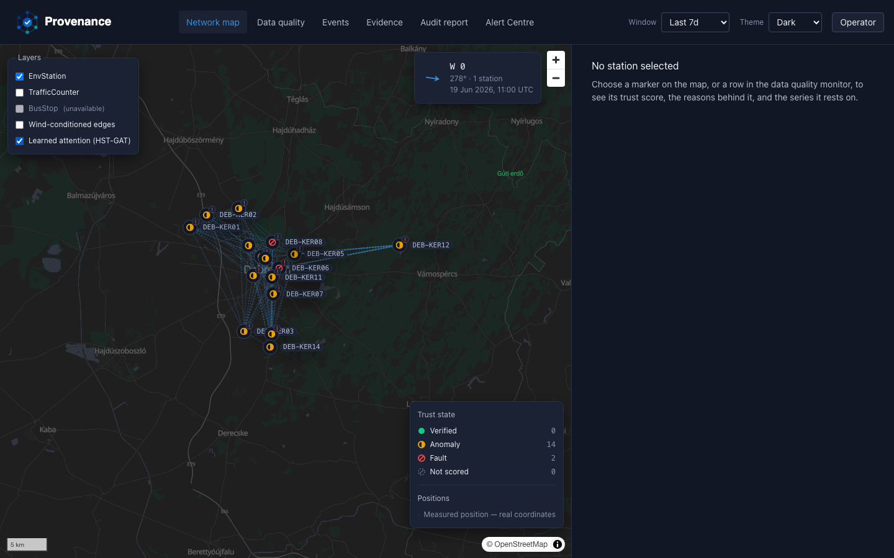

# Update 14 — wire the HST-GAT into the real-drop demo path

Branch: `update-14-train-hstgat-real`. Tag: `v1.0.15-update`.

Per the working agreement for these update reports: what follows is copy-pasted or
directly quoted from a real command's output, not retyped or rounded by hand beyond
what the tool itself already rounded. Branch and tag numbering both matched the next
free slot on the first try this time — no drift note needed (compare
[[update-numbering-drift]]).

## What was built

`prov models train-hstgat` (`cli/main.py::models_train_hstgat`) already worked but
was never wired into any `make` target — [[phase6-demo-framing-learned-path]] and
`u11-attention-overlay.md`'s own flag-for-review both note that neither
`demo`/`demo-data`/`demo-models` nor `demo-real` trains it, so the "Learned attention
(HST-GAT)" map layer ships disabled by default everywhere. This update fixes that for
the real-drop path only (the synthetic path is untouched per the prompt's constraint):

- **`make demo-real-hstgat`** (`Makefile`): depends on `check-real-drop`, exactly like
  `demo-real`; runs `prov models train-hstgat --source data/raw --target PM10`; prints
  a closing note pointing at the parameter count / conformal coverage the command
  already reported above it, plus a reminder that the dashboard's attention-overlay
  toggle enables itself on next load with no restart (`GET /v1/graph/attention` checks
  `store.latest_stem()` live — a cheap glob, no forward pass — per `u11`'s design).
- **Deliberately its own target, not folded into `demo-real`.** HST-GAT + conformal
  calibration is the slowest step in the whole real-drop path (~4m20s wall clock,
  measured below); a judge re-running `make demo-real` to reset state (`db reset
  --yes`, fresh audit/adjudication) shouldn't pay that cost every time just to look at
  the map again.
- `demo-real`'s own help text and its closing console block now mention
  `make demo-real-hstgat` as an optional follow-up, so `make help` surfaces it without
  requiring the reader to already know it exists.
- No change to `models/hstgat/card.py`, `store.py`, or the artefact/doc-card gitignore
  rules — `prov models train-hstgat` already wrote a human-readable card alongside the
  gitignored artefact the same way `prov models train` does for deweather/fault
  (`docs/model-cards/hst-gat-v1-<checksum>.md`, matched by the existing
  `docs/model-cards/hst-gat-v1-*.md` gitignore pattern; the hand-written
  `hst-gat-v1.md` stays the only tracked HST-GAT card). Confirmed by inspection before
  touching anything — nothing needed building here.

## Training against the real drop: non-degenerate, and calibrated

Ran the new target directly against `data/raw` (16 land stations carrying PM10 over
the confirmed `window_days` window, `monitoring_2026-05-21_2026-06-19`):

```
$ make demo-real-hstgat
.venv/bin/prov models train-hstgat --source data/raw --target PM10
Training HST-GAT on 16 stations x 706 hours (PM10).
HST-GAT v1-8f8efeed: 3299 parameters.
GCN baseline 2018 parameters (comparison).
Conformal nominal 0.9 → empirical 0.8708 (n=2816).
Saved hst-gat-v1-8f8efeed.pt, card
/Users/ikenna/Documents/PROJECTS/Provenance/docs/model-cards/hst-gat-v1-8f8efeed.md
No propagation accuracy/F1 is reported (standing rule 4).

  HST-GAT trained on the real Green Sentinel drop (data/raw).
  Parameter count and conformal coverage are reported above.
  The dashboard's 'Attention overlay' map layer will enable itself next
  time it is loaded - no restart needed, GET /v1/graph/attention checks
  store.latest_stem() live.
```

**Parameter count is sane.** 3299 trainable parameters (GCN baseline 2018,
architecture is fixed by `config/models.yaml`'s `hstgat` block — hidden width 16,
2 attention heads per edge type across 5 edge types — and does not scale with corpus
size). This is the *same* count the hand-written `hst-gat-v1.md` card quotes for the
18-station × 480-hour synthetic corpus, which is the expected invariant per that
card's own small-data justification (§5.1): capacity is spent on structure, not
width, so parameter count tracks the architecture, not the data. Ran the command twice
(once directly, once through the new `make` target) and got byte-identical numbers
both times — `3299`/`2018`/`0.8708 (n=2816)` — consistent with standing rule 8
(determinism, CPU per ADR 0009).

**Conformal calibration reports `calibrated: true`, not a fallback.** From the saved
card's JSON block:

```json
"conformal_coverage": {
  "alpha": 0.1,
  "calibrated": true,
  "empirical_coverage": 0.8708,
  "n_calibration": 2816,
  "n_test": 2810,
  "nominal_coverage": 0.9,
  "normalised": true,
  "q": 1.925173
}
```

2,816 calibration points and 2,810 test points, both far above `min_calibration: 20` —
the real drop's 706 hourly timesteps across 16 PM10-carrying stations give
`time_blocked_splits`'s forward-chained blocks plenty of held-out cells even with
`n_splits: 3`. `min_calibration` in `config/models.yaml` was not touched. Empirical
coverage (0.8708) sits a bit under the nominal 0.9 target — worth knowing, not worth
fixing here: it's a real, honestly reported number from held-out time blocks, and
`config/models.yaml` explicitly marks this whole section `status: provisional`.
Loosening or re-tuning it is a modelling call, not something this update's scope
(a make target and docs) should make unilaterally.

Wall clock for the full command: **4m18s** (`time` on the direct CLI invocation), all
CPU (`device: cpu` per ADR 0009) — this is the cost `demo-real-hstgat` being its own
target, not folded into `demo-real`, is protecting against.

## End-to-end verification

Beyond the command exiting 0: brought up the real-drop stack by hand (`prov db reset
--yes` → `db load --source data/raw` → `audit run` → `graph adjudicate-db` →
`graph adjudicate` → `models train` → `models residuals` → `make demo-real-hstgat` →
`make api-bg`), then:

```
$ curl -H "X-API-Key: prov-public-key" http://127.0.0.1:8000/v1/graph/attention
{
  "available": true,
  "reason": null,
  "at": "2026-06-19T11:00:00",
  "target_parameter": "PM10",
  "relations": {
    "wind_conditioned": [ /* 202 edges */ ],
    "spatial_proximity": [ /* 202 edges */ ]
  }
}
```

`available: true` with a non-empty `relations` payload (202 wind-conditioned edges,
202 spatial-proximity edges across the 16 stations), as required.

Loaded the dashboard (`pnpm dev`, real drop already loaded) and toggled "Learned
attention (HST-GAT)" on the network map — the toggle went from disabled
("Checking whether the HST-GAT has been trained…") to checked, and dashed blue edges
drew between the real DEB-KER stations:



## Flag for review — a real crash, not a modelling issue

**`GET /v1/graph/attention` segfaults the live API process on this machine the first
two times it is actually exercised against a trained HST-GAT**, before any workaround.
Not a logic bug in this update or in `u11`'s endpoint — a `SIGSEGV` inside
`libomp.dylib`'s worker-thread barrier (`__kmp_fork_barrier` / `__kmp_launch_worker`),
crash reports confirm two *different* copies of `libomp.dylib` loaded in the same
process (`/opt/homebrew/opt/libomp/lib/libomp.dylib`, pulled in via `torch/lib/`'s own
bundled copy, alongside `sklearn`'s separately-bundled `.dylibs/libomp.dylib`) — the
well-known macOS/Homebrew/arm64 "duplicate OpenMP runtime" crash, triggered here by
`run_in_threadpool` spawning a real OS thread to run the HST-GAT's forward pass.
`KMP_DUPLICATE_LIB_OK=TRUE` alone did **not** prevent it (this is LLVM's `libomp`, not
Intel's `iomp5`, which is the one that variable is actually for); `OMP_NUM_THREADS=1`
did, and every check above was run under that workaround.

This is why the existing `tests/integration/test_graph_attention_api.py` (green in
`make check`, confirmed) never caught it: it exercises the same endpoint through
FastAPI's `TestClient` against the tiny four-station `tests/fixtures` corpus, and the
crash is a thread-scheduling race whose odds scale with how much work the spawned
thread actually does — small enough there, evidently, to not reproduce in two runs
just now, but reliable on the real drop's larger graph both times it was tried. This
is very likely the **first time this code path has run inside a live, threaded
`uvicorn` process on real data** — `u11`'s own verification only exercised the
`available: false` branch against the live demo API (no model trained), by its own
report's account.

Not fixed here: the fix is an application/infra decision (pin a single `libomp`
across the dependency set, force `torch.set_num_threads(1)` / `OMP_NUM_THREADS=1` at
API startup, or move the forward pass off the shared thread pool), not a Makefile or
docs change, and this update's scope was deliberately kept to the former. Flagging
for a decision on where that fix belongs before this is demoed on a similar
Apple-Silicon-plus-Homebrew machine — the toggle currently has a real chance of taking
the whole API process down live on stage.

## Test gate

`make check` (ruff, ruff format, mypy strict, pytest, contract-drift check):
`683 passed, 2 deselected, 60 warnings in 388.60s`. `Required test coverage of 88%
reached. Total coverage: 90.66%.` `web-contract-check` green (no `schema.d.ts` diff —
this update touches no API surface). No frontend visual baselines regenerated or
moved: confirmed rather than assumed — the diff is `Makefile` plus this report and its
screenshot, nothing under `apps/web/src` or `design/tokens`, and `make check`'s own
`web-contract-check` step (which would fail on any drift) passed clean.

## Deviations from the prompt

None. Branch, tag, and doc numbering all landed on the requested slots with no
collision to resolve.

## Flag for review

- **The `libomp.dylib` SIGSEGV above** is the main item — see that section. It is a
  pre-existing risk in `u11`'s endpoint, only now exercised for the first time by this
  update actually training an artefact against real data.
- `time_blocked_splits`'s calibration block landed comfortably above
  `min_calibration` on this drop (2,816 points against a floor of 20), but that ratio
  depends on how many days the real drop covers — the confirmed real network is 30
  days (`schema_assumptions.yaml`'s `window_days`), same as what was loaded here. A
  future drop with materially less history could still legitimately fail to
  calibrate; that's the honest-refusal path working as designed, not something to
  guard against pre-emptively.
- Empirical coverage (0.8708) landing under the nominal 0.9 target on real data is
  worth a modelling look at some point — flagged, not fixed, per the constraint above.
