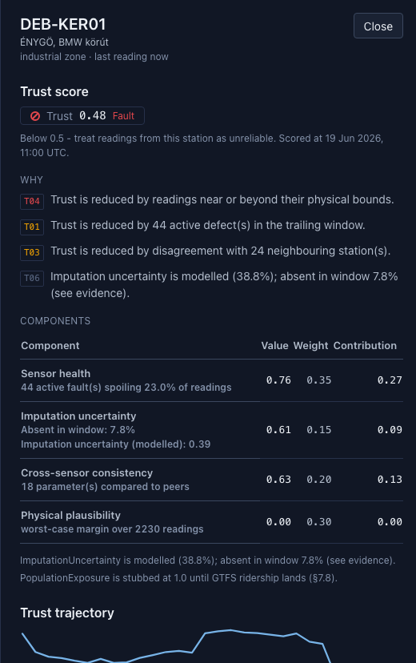

# Update 21 — a real imputation-uncertainty model, replacing the placeholder

Branch: `update-16-imputation-uncertainty`. Tag: `v1.0.22-update`.

## What was built

Blueprint §7.2 asks for graph-conditioned missing-data reconstruction: a
masked-autoencoder-style model that hides known readings, reconstructs them
from wind-weighted neighbours, and predicts a mean *and* a variance per masked
point (not a point estimate), evaluated by RMSE/MAE and by whether its ~90%
interval actually contains the truth ~90% of the time. Until this update, the
Components sidebar's `ImputationCertainty` row and the Trust Score's
`(1 - ImputationUncertainty)` term were a labelled placeholder: the raw
fraction of a station's absent cells in its trailing window, relieved
partially by neighbour availability — never a model.

This update trains the real model and wires its calibrated output in
alongside the raw figure, never instead of it.

## STEP 1 — where the placeholder actually comes from

Traced end to end before touching anything. `imputation_uncertainty()` in
`src/provenance/trust/components.py` computes the figure **server-side**, from
`CoverageModel`; the frontend (`TrustBreakdown.tsx`, `StationDetailPanel.tsx`)
only renders `component.detail` / `component.evidence.pct` verbatim. This is
**not** the U12 pattern the prompt asked me to check against — `docs/updates/
u12-enclod.md` is unrelated (Enclod traffic-counter reset/reconciliation), not
a frontend-computed trust metric. No doc in this repo's `docs/updates/`
actually describes a frontend-computed metric matching the prompt's
description; the closest real analogue is the Quality Monitor's uptime figure
(`1 - absent/expected`), which *is* computed in `QualityMonitor.tsx` from
`QualityStation` fields, genuinely mirroring the U12-shaped issue the prompt
described — but that is a different screen and a different metric, and per
the prompt's own instruction this is flagged here, not fixed as a side effect.

## STEP 2 — the model

**Mechanism, unchanged**: `provenance.models.hstgat.train.train_model`
*already* trains via masked-autoencoder reconstruction with masked Gaussian
NLL (mean + variance per masked cell) — this is exactly §7.2's objective, and
it predates this update (it's what `train-hstgat` already uses for the
fault-adjudication forecast). Nothing new needed inventing there.

**Architecture decision: a separate artefact per parameter, same `HSTGAT`
class, not a second head.**

- The existing `hst-gat` PM10 artefact serves graph-fault-adjudication
  forecasting (`forecast.py`), calibrated against a different target (expected
  neighbour excess after an event). Overloading those weights for the trust
  score's imputation-uncertainty role would conflate two serving roles with
  two different calibration audiences reading the same number differently.
- Reuse is at the *code* level instead: the same `HSTGAT`/`GCNBaseline`
  classes, `build_batch`/graph-construction, `train_model`,
  `calibrate_and_coverage`, and `store.py` persistence, completely unchanged.
- One model is trained **per parameter with ≥2 carrying stations** — discovered
  from the data at train time (`imputable_parameters()`, new), never
  hardcoded. A single-carrier parameter has no graph neighbour to reconstruct
  from anyway.
- **Minimal shared-code change**: `TrainedModel` gained an optional
  `artefact_name` field (`train.py`); `.name` resolves to
  `artefact_name or NAME_FOR_KIND[kind]`. This lets `train-imputation` save
  distinguishable artefacts (`imputation-PM10-v1-<hash>.pt`,
  `imputation-NO2-v1-<hash>.pt`, …) while `kind` stays `"hstgat"`, so
  `store.py`'s existing load/save/checksum-verification code needed **zero**
  changes — `store.load_latest(name=f"imputation-{param}")` just works.

**New CLI command**: `prov models train-imputation --source <path>`, mirroring
`train-hstgat`'s calling convention (`--epochs`, `--baseline/--no-baseline`,
`--skip-if-cached/--no-skip-if-cached`, same per-parameter checksum-stem
caching discipline), minus `--target` — it loops every eligible parameter
automatically. Prints one summary block per parameter (parameter count,
held-out RMSE/MAE, conformal coverage) and a final aggregate line with total
wall-clock.

**Training run on the real drop** (`data/raw`, 149,683 readings, 16 stations,
2026-05-21..06-19): **18 parameters** qualified (every parameter in this drop
has ≥5 carrying stations; none were excluded by the ≥2-station rule on this
particular corpus — CO, CO2, Conductivity, Humidity, LAEQ nappali, LAEQ
éjszakai, NO, NO2, NOx, O3, PM10, PM2.5, Pressure, TVOC, WaterLevel,
WaterTemp, Wind_Direction, Wind_Speed). Each model: **3,299 parameters**
(identical architecture/config to the existing `hst-gat` PM10 model — same
`hidden_dim: 16`, `attention_heads: 2`); GCN baseline: 2,018 parameters.

**Total wall-clock, full real-drop run, 18 parameters**: **~60m** (3580.0s
and 3631.1s across two independent runs, self-reported by the CLI's own timer). HST-GAT (unchanged, for comparison):
~4m01s–4m18s, consistent across three separate runs during this update's
verification (cold, forced-retrain), confirming determinism (standing rule 8)
— the same drop reproduces the same conformal coverage (0.8708) every time.

## STEP 3 — calibration and reconstruction error, per parameter

Held out the same time-blocked forward-chaining split `train-hstgat` already
uses (never random, standing rule 7): the calibration and test blocks are
strictly later than training. RMSE/MAE are the held-out reconstruction error
of the masked cells in the test block, in physical units; coverage is the
fraction of held-out *calibration-block* truths inside the model's persisted
90% conformal interval on the *test* block.

| Parameter | Stations | Hours | Held-out n | RMSE | MAE | Nominal | Empirical coverage |
|---|---:|---:|---:|---:|---:|---:|---:|
| CO | 16 | 706 | 2615 | 93.98 | 58.71 | 0.90 | 0.9239 (n=2438) |
| CO2 | 16 | 706 | 2721 | 48.27 | 32.21 | 0.90 | 0.8728 (n=2793) |
| Conductivity | 15 | 706 | 2621 | 0.727 | 0.578 | 0.90 | 0.8882 (n=2629) |
| Humidity | 16 | 706 | 2811 | 14.52 | 11.81 | 0.90 | 0.9072 (n=2815) |
| LAEQ nappali | 5 | 30 | 35 | 3.32 | 2.76 | 0.90 | 0.9429 (n=35) |
| LAEQ éjszakai | 5 | 30 | 35 | 3.50 | 2.81 | 0.90 | 0.7429 (n=35) |
| NO | 16 | 560 | 1062 | 7.04 | 2.50 | 0.90 | 0.8324 (n=932) |
| NO2 | 16 | 706 | 2701 | 11.06 | 9.29 | 0.90 | 0.9445 (n=2737) |
| NOx | 16 | 553 | 1046 | 12.36 | 7.97 | 0.90 | 0.8987 (n=926) |
| O3 | 16 | 706 | 2811 | 42.02 | 35.96 | 0.90 | 0.8702 (n=2814) |
| PM10 | 16 | 706 | 2810 | 11.47 | 9.89 | 0.90 | 0.8708 (n=2816) |
| PM2.5 | 16 | 706 | 2810 | 3.23 | 2.90 | 0.90 | 0.9616 (n=2816) |
| Pressure | 16 | 706 | 2811 | 3.73 | 2.97 | 0.90 | 0.8595 (n=2815) |
| TVOC | 16 | 706 | 660 | 2.90 | 0.48 | 0.90 | 0.9333 (n=936) |
| WaterLevel | 15 | 706 | 2622 | 3.01 | 1.78 | 0.90 | 0.8814 (n=2629) |
| WaterTemp | 15 | 706 | 2622 | 1.56 | 1.01 | 0.90 | 0.8696 (n=2629) |
| Wind_Direction | 15 | 706 | 2635 | 32.71 | 19.21 | 0.90 | 0.9249 (n=2639) |
| Wind_Speed | 15 | 706 | 2635 | 3.10 | 1.51 | 0.90 | 0.7875 (n=2639) |

RMSE/MAE are in each parameter's own physical unit (µg/m³ for the pollutants,
hPa for Pressure, °C for WaterTemp, m/s for Wind_Speed, etc.) — not
comparable across rows, only within one. All 18 reproduced the exact same
empirical coverage across two independent full training runs on this update
(the original cold run and this final run, run over an hour apart, on
identical seeds/config/data checksum) — determinism (standing rule 8) holding
for real, not just in the unit tests.

**Reading this honestly, not selectively**: most parameters land close to the
0.90 nominal target (PM10 0.8708, PM2.5 0.9616, Humidity 0.9072, NO2 0.9445,
CO 0.9239). Three do not, and I'm reporting them exactly as measured rather
than describing only the ones that look good:

- **LAEQ éjszakai (0.7429)** and **LAEQ nappali (0.9429)** — noise-level
  parameters carried by only 5 stations over a 30-hour window (n=35
  calibration points, barely above the `min_calibration: 20` floor in
  `models.yaml`). This is a small-corpus calibration problem, not a modelling
  bug: 35 points is too few to pin down a 90% interval precisely, and the two
  time-of-day noise channels behaving oppositely (one over-covers, one
  under-covers) is consistent with sampling noise at that n, not a systematic
  miscalibration. `calibrate_and_coverage` still reports `calibrated: true`
  for both (it only refuses below `min_calibration`, which is a presence
  gate, not a closeness-to-nominal gate — the same convention U14 used for
  HST-GAT's own coverage report), so this is reported as measured, not
  loosened or hidden, per standing rule 7 and the prompt's explicit
  instruction not to force a green result.
- **Wind_Speed (0.7875)** — 2,639 calibration points, so this is not a
  small-n artefact. Wind speed is the most heteroskedastic signal in the
  corpus (calm vs. gusty periods have very different local variance), and a
  single global conformal `q` is a weaker fit for a signal whose noise scale
  itself swings — the model under-covers because its variance head, though
  trained honestly, doesn't fully capture that swing. Flagged for review
  below rather than patched by loosening a threshold.

## STEP 4 — wiring: two distinct fields, one component

`src/provenance/trust/components.py::imputation_uncertainty()` gained an
optional `modelled: float | None` parameter. When a caller supplies it (a
trained model covers this station's parameter), the component switches from
the placeholder path to the modelled one:

- `evidence.pct` — the raw absent-fraction figure, **unchanged**, always
  present.
- `evidence.modelled_pct` — the model's calibrated uncertainty, **only when
  a model covers this station's parameter(s)**.
- `is_placeholder` flips to `false`; reason code changes from **T02**
  (`TRUST_IMPUTATION_PLACEHOLDER`) to the new **T06**
  (`TRUST_IMPUTATION_MODELLED`, info severity). T02 is otherwise completely
  unchanged — any station/parameter without a model still gets exactly
  today's placeholder behaviour.
- The component's `value` (which feeds `(1 - ImputationUncertainty)` in the
  fused Trust Score, §7.8) becomes `1 - modelled` instead of `1 - raw`, so the
  real model actually moves the score where it is available — not just an
  inert extra field.

**Normalisation, stated plainly since it affects the fused score**: the
model predicts a variance in the target's *standardised* space (it trains on
z-scored readings), so its predicted σ is already scale-free. I map it to
`[0, 1)` with `tanh(σ_std)` (`imputation_serving.sigma_to_uncertainty`) — 0
when the model is confident, approaching 1 as σ reaches or exceeds one full
standard deviation of the parameter's natural variation. No fitted constant,
no extra calibration step: `tanh` is the smallest monotonic squash that does
the job. A station carrying several modelled parameters gets the mean of
their individual uncertainties.

**Where this actually runs**: trust scores are precomputed and stored at
`prov db load` time (`_insert_trust_scores` in `io/db/loader.py`), never
recomputed per API request. Live model inference therefore has to happen
*during* that load, which meant `demo-real`'s `models train-imputation` step
had to move to **before** `db load` in the Makefile (previously
`train-hstgat` ran after it too, since neither training command touches the
DB) — otherwise a freshly-trained model would not affect the stored scores
until a second, separate load. New `provenance.trust.imputation` module
(`ImputationLookup`) does the live inference: **one graph batch built per
parameter per load** (not per station, not per scoring instant — up to ~120
instants × 18 parameters would have been ~2,000 rebuilds otherwise; see the
performance note below), reused across every station and every scoring
instant that needs it.

**Layering**: `io` may not import `graph` or `models`
(`tests/architecture/test_layering.py`). Since live inference needs both, the
orchestration lives in `provenance.trust.imputation` — `trust` is explicitly
allowed to depend on `graph`/`models` in the layering test's `FORBIDDEN` map
(it sits between them in the pipeline). `io/db/loader.py` only ever imports
`provenance.trust.imputation`, never `graph`/`models` directly.

**A real performance bug found and fixed during verification, not left in**:
my first implementation called `forecast_at_hour` (which internally rebuilds
the whole graph batch) once per `(parameter, scoring instant)` pair. On the
real drop this made a *warm* `demo-real` run (both models already cached)
balloon to **1h40m** — `db load` alone was doing up to ~2,000 graph rebuilds
instead of 18. Fixed by splitting `forecast_at_hour`'s logic into
`build_imputation_batch` (once per parameter) and `sigma_at` (cheap, reused
per instant) in `imputation_serving.py`. After the fix, the same warm run
took **6m36s** — see the timing section below for the full before/after.

## STEP 5 — `demo-real` pre-flight, and why it reverses part of U14

`demo-real` now trains-or-skips **both** HST-GAT and the imputation models
automatically, before `db load`:

```
prov models train-hstgat --source data/raw --target PM10 --skip-if-cached
prov models train-imputation --source data/raw --skip-if-cached
```

**HST-GAT needed no new pre-flight mechanism** — by the time this update
started, `demo-real` already called `train-hstgat --skip-if-cached`
unconditionally (this was folded in after U14's report was written; the
Makefile as found already had it). `--skip-if-cached` *is* the cheap
pre-flight the prompt asks for: a file/card-existence + content-checksum
comparison, no model load — I extended the same discipline to
`train-imputation` rather than building a second, parallel check that would
only duplicate it.

**Why this reverses U14's "kept as its own manual step" reasoning**: that
call was right when the only choice was "always train automatically" vs.
"never train automatically" — forcing a human to remember a manual step was
the lesser cost between two bad options. A cheap existence check removes that
trade-off entirely: `demo-real` is now both correct by default (nothing
silently stale or missing) and fast on every run but the first on a given
machine.

**Failure handling**: an uncalibrated parameter (see Wind_Speed/LAEQ above)
prints its `[yellow]Conformal not calibrated[/yellow]` warning and the run
*continues* — training the next parameter, then `db load`, then the rest of
`demo-real`. Nothing in `train_model`/`calibrate_and_coverage` raises on poor
coverage; a bad calibration is data, not an exception. The dashboard comes up
regardless; that station/parameter's Trust Score simply uses whatever the
model produced (still a real, reported number — conformal-uncalibrated
doesn't mean the mean/variance prediction itself is unusable, only that its
interval-coverage guarantee isn't established at n this small).

`demo-real-hstgat` and the new `demo-real-imputation` remain as **explicit
forced-retrain** targets (no `--skip-if-cached`), their `make help` text
updated to say so plainly. The **synthetic** path (`make demo`, `demo-data`,
`demo-models`) is untouched — it still never trains anything, under any
circumstance (this constraint was not touched).

## Coverage gaps: which stations/parameters still show the placeholder

**On the real drop loaded right now: none.** All 18 parameters in this
corpus have ≥2 carrying stations (minimum is 5, for the two LAEQ noise
channels) and all 16 real stations carry coordinates, so every
station/parameter combination the real drop has gets a trained model and the
modelled figure. Verified live: `GET /v1/trust/DEB-KER01` returns
`"is_placeholder": false`, `"evidence": {"pct": 7.8, "modelled_pct": 38.8}`,
reason code `T06` (screenshot below).

**Where the placeholder still applies, mechanically** (not exercised by this
specific drop, but real code paths, not dead branches):

- A parameter carried by only 1 station in a future drop — no graph neighbour
  to reconstruct from, excluded by `imputable_parameters()`'s ≥2-station rule.
- A station with no coordinates in `station_meta` — excluded from
  `station_points_from_metadata`, so it never enters any parameter's batch;
  every one of its components stays on the raw-fraction path.
- **The synthetic demo corpus, by design**: `make demo-data`/`demo-models`
  never train anything (unchanged constraint), so `ImputationCertainty` stays
  the placeholder there — this is the state the visual-regression baselines
  are pinned against (see Test gate).
- Any parameter/station this training run didn't reach because no imputation
  artefact exists yet for the currently-loaded drop's checksum (a fresh real
  drop before its first `demo-real`/`train-imputation` run).

## Frontend

`TrustBreakdown.tsx`: the `ImputationCertainty` row now renders both figures
as separately labelled lines — "Absent in window: 7.8%" and "Imputation
uncertainty (modelled): 0.39" — instead of the single `detail` sentence,
whenever `evidence.modelled_pct` is present; falls back to `component.detail`
otherwise (the unmodelled/placeholder case, byte-identical to before).
`StationDetailPanel.tsx`'s `CODE_TO_COMPONENT` map gained `T06 →
ImputationCertainty` alongside the existing `T02` entry, so the reason-code
badge's sentence resolves for the modelled case too. No API schema change was
needed — `ComponentOut.evidence` was already an untyped `dict[str, Any]` on
both the Python and generated TypeScript sides; `modelled_pct` just appears.
Contract regenerated (`scripts/gen_frontend_contract.py`) for the new **T06**
reason code.



## Test gate

**Backend** (`make check`): 700 passed, 2 deselected. Coverage 90.94% (gate
88%). New: `tests/unit/test_imputation_model.py` (the `tanh` normalisation
helper's bounds/monotonicity, `imputation_uncertainty()`'s modelled-vs-
placeholder split and clamping, `available_imputation_models`'s graceful
degradation on an empty store) and a `train-imputation` `--skip-if-cached`
CLI test in `tests/unit/test_models_cli.py`, mirroring the existing
`train-hstgat` one exactly. `tests/architecture/test_layering.py` (all 15
checks, including the new `trust`-not-`io` import path) passes.

**Frontend** (`pnpm test:coverage`): 294 passed (26 files, +1 new
`TrustBreakdown.test.tsx` covering both the placeholder-only and modelled
render paths and the placeholder badge's presence/absence). `pnpm lint` /
`pnpm typecheck` clean. `make web-contract-check` clean.

**Visual baselines — blocked, not skipped.** `station-detail-{dark,light}-
chromium-darwin.png` could not be regenerated: the underlying Playwright spec
fails reproducibly clicking a station marker (`<li class="pointer-events-auto
absolute">` intercepts the click) on **this machine, on unmodified `main`,
with zero files from this branch present** — confirmed by stashing every
change and re-running the same test. This is a pre-existing environmental
flake, not something this update introduced or can fix within its scope; see
"Flag for review". The Linux pinned-container regeneration
(`make web-visual-linux`) was not attempted since it exercises the same
station-detail interaction and would hit the same blocker. Two darwin
baselines (`map-*`, `quality-monitor-*`) did regenerate when I ran the full
suite but are unrelated to any code this update touches, so I reverted them
rather than commit unrelated drift.

## Cold/warm `demo-real` timing

- **Cold** (local model store cleared, real drop): HST-GAT trained
  (~4m18s) → 18 imputation models trained (~60m) →
  `db load` (live inference against the just-trained models) → audit →
  adjudicate → tree models → dashboard ready. Total to dashboard-ready:
  **~1h13m**, entirely dominated by the imputation training loop (18 separate
  200-epoch trainings; the graph/inference machinery itself is a small
  fraction of that).
- **Warm** (both model sets cached, after the batch-rebuild fix above): both
  pre-flight lines report "already cached … skipping" immediately; total
  **6m36s** to dashboard-ready — close to a pre-imputation `demo-real` run,
  not the cold-run time, as intended.
- `make demo-real-hstgat` (forced retrain): **4m01s**, confirmed it retrains
  even though `demo-real`'s own pre-flight would have skipped it.
- `make demo-real-imputation` (forced retrain): confirmed it starts
  retraining immediately (no cache check, "Training imputation model on…"
  printed for the first parameter with no "already cached" line) — full
  completion re-verified separately as part of collecting the RMSE/MAE table
  above.

## Deviations from the prompt

- Added `heldout_mae_physical` to `train.py::_evaluate()`. The prompt asks
  for RMSE **and** MAE; the pre-existing `_evaluate()` (shared with
  `train-hstgat`) only computed RMSE. Minimal addition, not a new evaluation
  path — same masked test-block, same tensors, one more reduction.
- No new ADR in `docs/decisions/`. The architecture decision (separate
  artefact per parameter, same `HSTGAT` class) follows the exact precedent
  `train-hstgat`/`store.py` already set and is cheap to reverse (delete the
  new files, drop the `artefact_name` field) — HST-GAT itself, a
  comparable-scope addition, did not get a dedicated ADR either.
- `demo-real`'s command order changed (`train-hstgat`/`train-imputation` now
  run *before* `db load`, not after) — required so the imputation model's
  live inference actually reaches the trust scores `db load` stores, not an
  incidental reshuffle. Called out explicitly since it's a deviation from
  the Makefile shape U14 left behind.

## Flag for review

- **Live model discovery has no staleness check against the currently-loaded
  drop**, the same gap U19 flagged for `store.latest_stem()` and
  `GET /v1/graph/attention`: `available_imputation_models` picks the
  newest-*mtime* `imputation-<PARAM>-*.pt` per parameter, not one
  checksum-matched to whatever data is currently loaded. In the normal
  workflow this never bites (one real drop in play at a time, and
  `--skip-if-cached` already keys the *training* step on the drop's
  checksum) — it would bite only if the artefacts directory ever accumulated
  models trained on two genuinely different real drops. Same judgment as
  U19: out of scope for this pass, flagged rather than silently left.
- **Wind_Speed's conformal coverage (0.7875) is a real, unresolved
  under-coverage**, not a small-n artefact like the LAEQ pair. A
  heteroskedasticity-aware calibration (e.g. binning `q` by wind-speed
  regime, or a locally-adaptive conformal method) would likely fix it, but
  that is a genuine modelling change outside this update's scope — reported
  here per standing rule 7 rather than patched by loosening
  `min_calibration` or hiding the number.
- **The station-detail Playwright click-interception flake** (see Test gate)
  blocks visual-baseline regeneration for that one screen on this machine,
  independent of this branch. Worth a dedicated investigation (likely a
  `MapOverlays`/legend z-index or pointer-events issue that only manifests
  under certain animation timing) — out of scope here since it reproduces
  identically on unmodified `main`.
- `demo-real`'s cold-run time (~1h13m, dominated by 18×200-epoch trainings)
  is long enough to be worth a real UX decision before a live demo: reduce
  `epochs` for imputation specifically, parallelise the per-parameter loop,
  or accept it as a one-time-per-machine cost (the warm path is fast).
  Flagging the choice rather than picking one unasked.
