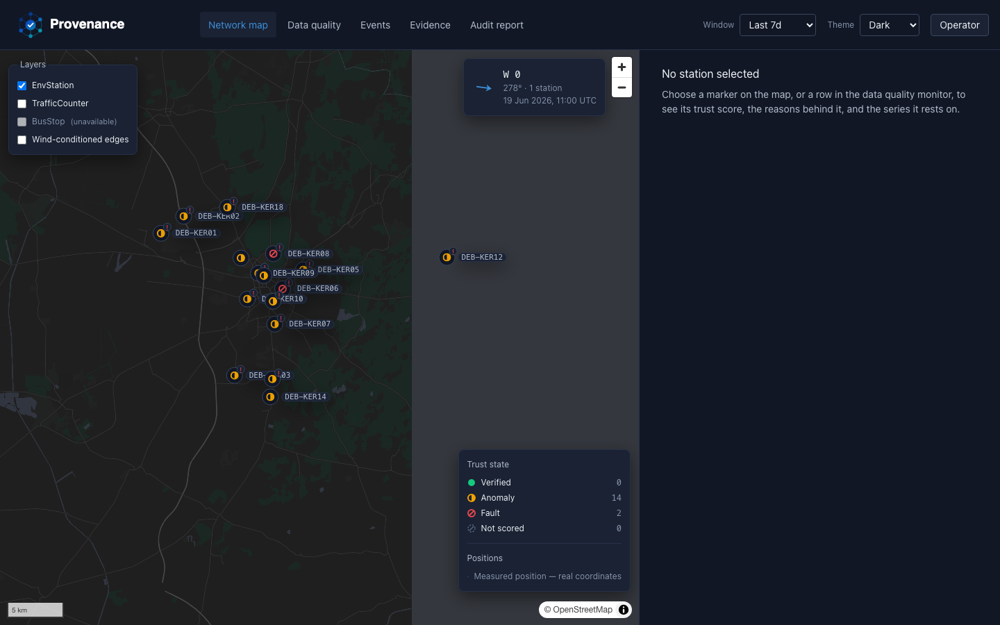

# Update 6 — a documented path onto the real Green Sentinel drop

Branch: `update-6-real-drop`. Tag: `v1.0.7-update`.

This is a report of what the pipeline produced, verbatim, with the command that
produced each number. Per the prompt: no headline number is declared here, and
the KER11 verdict is not adjudicated by this document — both are for the person
reading this to decide. Everything below is copy-pasted or directly quoted from
a real command's stdout or a real report file; nothing is retyped or rounded by
hand beyond what the tool itself already rounded.

## What was built

1. **`make demo-real`** (and its guard, `make check-real-drop`) in `Makefile`.
   Mirrors `make demo` step for step — stack up, DB loaded, audited,
   adjudicated, models trained, residuals stored, API up, dashboard open — but
   every step points at `data/raw` instead of the synthetic `.demo-corpus`.
   `make demo` itself is untouched: it still loads the synthetic 18-station
   corpus and is still what CI's contract/visual gates use.
   `check-real-drop` fails loudly, before anything touches the database, if
   `data/raw` holds nothing but its `.gitkeep` placeholders — it does not fall
   back to the fixtures, it stops:

   ```
   $ make check-real-drop
     data/raw is EMPTY (only .gitkeep placeholders) - there is no real Green
     Sentinel drop to load.

     'make demo-real' refuses to fall back to the synthetic fixtures; that
     fallback is what 'make demo' is for. Put the real export under data/raw
     (e.g. data/raw/green_sentinel/<drop>/DEB-KER*/*.xlsx) and try again.

   make: *** [check-real-drop] Error 1
   ```

2. **A real bug this surfaced, fixed**: `io/db/loader.py`'s `_insert_stations`
   and `_insert_parameters` did a bare insert with no existing-row check.
   `stations.station_id` and `parameters.name` are global primary keys, not
   scoped to the `ingest_batch` that loaded them. The synthetic demo corpus and
   the real Green Sentinel export share a lot of pollutant vocabulary (`CO2`,
   `PM10`, `NO2`, ...), and the local dev Postgres already had the synthetic
   corpus loaded from earlier work on this branch, so the very first `prov db
   load --source data/raw` crashed:

   ```
   IntegrityError: (psycopg.errors.UniqueViolation) duplicate key value violates
   unique constraint "parameters_pkey"
   DETAIL:  Key (name)=(CO2) already exists.
   ```

   Fixed by having both functions query the names already on record and skip
   re-inserting them (`src/provenance/io/db/loader.py`). A regression test
   pins it: `tests/unit/test_db_loader.py::test_a_second_batch_sharing_stations_or_parameters_does_not_collide`.
   This is orthogonal to the "real vs. synthetic" question below — it is a
   pre-existing idempotency gap that this update's actual use case (two
   different corpora, same shared local Postgres) was the first thing to hit.

3. **`demo-real` resets the database rather than upgrading it in place**, for
   the same reason: a same-session `make demo` had already loaded 18 synthetic
   `STA-*` stations, and without a reset the network map rendered 34 markers —
   16 real `DEB-KER*` stations plus 18 leftover synthetic ones scattered across
   the same canvas. `prov db reset --yes` (drop + rebuild schema, local dev
   only) runs before the load so `demo-real`'s map and audit show the real drop
   only. This is a destructive operation on local dev data; it is not run
   against anything shared, and the synthetic side is regenerated in seconds
   with `make demo-data`.

## Real vs. synthetic — the comparison

| | **Real** (`data/raw`, the Green Sentinel export) | **Synthetic** (`.demo-corpus`, `make demo`'s 18-station corpus) |
|---|---|---|
| Station count | **16** | **18** |
| Station ids | `DEB-KER01`–`DEB-KER15`, `DEB-KER18` (no `DEB-KER16`/`17` — 16 numbered but not contiguous) | `STA-01`–`STA-18` |
| Coordinates | Parsed from the `Location` column for all 16 (`"<site name> (<lat>, <lon>)"`, e.g. `DEB-KER01` → `ÉNYGÖ, BMW körút (47.577175, 21.502204)`) | No `Location` column exists in the synthetic export shape; all 18 come from a `stations.json` sidecar the fixture generator writes alongside the corpus |
| Readings loaded | 149,683 (`prov db load`) / 149,683 (`prov audit run`'s `n_rows`) | 35,265 (`prov audit run`'s console count) / 35,263 (`audit.json`'s `n_observed_cells`) |
| Conventional completeness | **100.0000%** | **100.0000%** |
| Grid completeness (station × parameter × hour) | **85.7374%** (149,683 observed / 174,583 covered cells; 24,900 absent) | **99.9518%** (35,263 / 35,280; 17 absent) |
| Defect rate | **29.1225%** (50,843 / 174,583 covered cells) | **2.9620%** (1,045 / 35,280 covered cells) |
| Top 5 reason codes by count | R01 `ROW_ABSENT` 24,900 · R12 `ZERO_VARIANCE` 12,194 · R10 `UNIT_INCONSISTENT` 10,627 · R13 `LOW_VARIANCE_DEGRADED` 5,622 · R02 `COMM_GAP` 939 | R10 `UNIT_INCONSISTENT` 336 · R12 `ZERO_VARIANCE` 336 · R13 `LOW_VARIANCE_DEGRADED` 336 (three-way tie) · R01 `ROW_ABSENT` 17 · R11 `DETECTION_LIMIT_FLOOR` 8 |
| Wind present | Yes — `Wind_Speed`/`Wind_Direction` at **15 of 16** stations (`DEB-KER15` is the one documented structural absence — no wind sensors, excluded from the defect rate per rule 3) | No — **0 of 18** stations carry `Wind_Speed`/`Wind_Direction` at all |
| `prov graph adjudicate-db` | 19 stored events adjudicated, verdicts written to the DB | (not run against the DB for this comparison — file-based `adjudicate` used instead, see below) |
| `prov graph adjudicate` top-ranked event | `DEB-KER11` / `PM10` @ `2026-06-02T20:00:00`, excess **4,078.6 µg/m3**, verdict **`LIKELY_FAULT`**, confidence **1.00 (high)** | `STA-03` / `PM10` (3 tied top-ranked instances), excess **2,970.0 µg/m3**, verdict **`AMBIGUOUS`**, confidence **0.50 (moderate)** |

The **149,683 readings** figure matches CLAUDE.md's thesis paragraph exactly.
The **"roughly 99.95% completeness"** figure in that same paragraph does not
match this real drop's own completeness numbers — this run's real conventional
completeness is 100.0000% and its real grid completeness is 85.7374%. The
synthetic corpus's grid completeness (99.9518%) is the one that lands close to
99.95%. Flagging this discrepancy verbatim, not resolving it — it is exactly
the kind of headline-number question the prompt reserves for the person
reading this.

## The KER11 ~4,100 µg/m³ reading — what the pipeline returned

Command: `prov graph adjudicate --data data/raw --out reports/adjudications --limit 10`

Full bundle, `reports/adjudications/adj_01_DEB-KER11_PM10_2026-06-02T20-00-00.json`:

```json
{
  "confidence": 1.0,
  "confidence_band": "high",
  "event": {
    "anomaly_score": 1.0,
    "baseline": 22.1,
    "excess": 4078.6,
    "parameter": "PM10",
    "station_id": "DEB-KER11",
    "timestamp_utc": "2026-06-02T20:00:00",
    "unit": "µg/m3",
    "value": 4100.7
  },
  "verdict": "LIKELY_FAULT",
  "routes_to_review": false,
  "evidence": {
    "expectation_provenance": "analytic",
    "reason_codes": ["R17"],
    "match_score": 0.0,
    "n_downwind": 5,
    "n_usable": 5,
    "downwind_neighbours": [
      {"station_id": "DEB-KER09", "distance_km": 2.7829, "bearing_deg": 332.63, "arrival_delay_min": 17.18, "expected_excess": 2337.7072, "actual_excess": -0.05, "corroborated": false},
      {"station_id": "DEB-KER15", "distance_km": 2.4044, "bearing_deg": 340.43, "arrival_delay_min": 14.96, "expected_excess": 2521.5398, "actual_excess": 1.05, "corroborated": false},
      {"station_id": "DEB-KER13", "distance_km": 4.7481, "bearing_deg": 323.52, "arrival_delay_min": 29.72, "expected_excess": 1577.9758, "actual_excess": -0.4, "corroborated": false},
      {"station_id": "DEB-KER18", "distance_km": 9.2062, "bearing_deg": 334.14, "arrival_delay_min": 56.84, "expected_excess": 646.952, "actual_excess": -0.65, "corroborated": false},
      {"station_id": "DEB-KER08", "distance_km": 4.2022, "bearing_deg": 0.5, "arrival_delay_min": 29.22, "expected_excess": 1760.0053, "actual_excess": 0.1, "corroborated": false}
    ],
    "series": {
      "timestamps": ["2026-06-02T20:00:00", "2026-06-02T21:00:00"],
      "actual": [0.0, 0.168],
      "expected": [0.0, 2049.6633]
    },
    "wind": {"from_deg": 153.1, "to_deg": 333.1, "speed": 2.7, "speed_unit": "km/h", "station_count": 1, "provenance": "station-local"},
    "notes": ["No headline accuracy figure is reported for this method (standing rule 4)."]
  }
}
```

Code path: `prov graph adjudicate` → `provenance.graph.replay.replay_path` → the
phase-4 wind-conditioned graph and analytic adjudicator (`expectation_provenance:
"analytic"` — no `--learned` flag was passed, so this is the B3 analytic prior,
not the phase-6 HST-GAT). Reason code fired: **R17**. All 5 downwind neighbours
within range are `"corroborated": false` — none shows a matching plume arrival.
The reading drops from 4,100.7 to 0.168 at the very next hour.

`prov graph adjudicate-db --source data/raw` separately adjudicated **19**
events stored from the audit and wrote their verdicts back to the database
(console output: `Adjudicated 19 stored event(s); verdicts written.`).

## Command transcript (abridged — openpyxl/scipy warnings stripped)

```
$ prov db reset --yes
Schema reset and at head.

$ prov db load --source data/raw
Loaded 149,683 readings, 56,738 defects, 480 trust scores (run ar_8f8efeedfabdccaa_3cc81ae804ad891a).

$ prov audit run --data data/raw --out reports
149,683 readings  conventional completeness 100.0000%
50,843 defective cells  defect rate 29.1225%
  R01  ROW_ABSENT                   24,900
  R02  COMM_GAP                     939
  R07  EXCEEDS_PHYSICAL_MAX         1
  R09  CROSS_PARAM_INVERSION        100
  R10  UNIT_INCONSISTENT            10,627
  R11  DETECTION_LIMIT_FLOOR        2,111
  R12  ZERO_VARIANCE                12,194
  R13  LOW_VARIANCE_DEGRADED        5,622
  R14  STEP_CHANGE                  236
  R18  PARAMETER_ABSENT_STRUCTURAL  2
  R19  SOURCE_ABSENT                3
  R21  SENSOR_DEAD                  3
Wrote reports/audit.json, reports/audit.md, reports/audit.html

$ prov graph adjudicate-db --source data/raw
Adjudicated 19 stored event(s); verdicts written.

$ prov graph adjudicate --data data/raw --out reports/adjudications --limit 10
[table — see comparison section and the KER11 bundle above]
9 event(s) routed to human review (AMBIGUOUS).
Wrote 10 bundle(s) and an index to reports/adjudications

$ prov models train --source data/raw
Training on real drop data/raw (149,683 readings, in-situ weather).
Deweather v1-8f8efeed: CO R²=-0.15, NO2 R²=0.11, O3 R²=0.38, PM10 R²=-1.96
Fault v1-c40c8de5: recall drift=0.12, flatline=1.00, gain=0.33 | meteo precision 0.98
Saved deweather-v1-8f8efeed.joblib, card docs/model-cards/deweather-v1-8f8efeed.md
Saved fault-v1-c40c8de5.joblib, card docs/model-cards/fault-v1-c40c8de5.md
No headline accuracy is reported for the classifier (standing rule 4).

$ prov models residuals --source data/raw
Stored 42,308 residuals under model v1-8f8efeed.
```

`56,738 defects` (db load) vs. `50,843 defective cells` (audit run) is not a
discrepancy: the sum of every `defects_by_code` count is exactly 56,738 — one
row per (cell, reason code) hit — while `n_defective_cells` deduplicates to one
row per cell regardless of how many codes fired on it. Both numbers came
straight off the two commands above.

## Screenshot: the real station scatter

Command: `curl -H "X-API-Key: prov-public-key" localhost:8000/v1/stations` (16
items, all with real `lat`/`lon`) confirmed before capture; screenshot taken
against the dev server + API with the real drop loaded and the fetched
Debrecen basemap present (`make basemap`), dark theme, "Network map" tab,
default "Last 7d" window.



16 markers, all `DEB-KER*`, all on real streets. The map's own trust-state
tally in this screenshot (0 verified · 14 anomaly · 2 fault · 0 not-scored)
comes from the API at capture time and is not retyped here.

## Test gate

`make check` (ruff, ruff format, mypy strict, pytest with the 88% coverage
gate, contract-drift check) run **with `data/raw` moved entirely outside the
repo** (only the four `.gitkeep`-only placeholder directories left in its
place, byte-for-byte what a fresh clone has) — CLAUDE.md rule 7:

```
667 passed, 2 deselected, 58 warnings in 306.34s (0:05:06)
Required test coverage of 88% reached. Total coverage: 90.61%
Frontend contract is current.
```

The real drop was restored immediately after and reverified present
(`check-real-drop` exits 0 again; `find data/raw -iname 'DEB-KER*'` → 16).

## Deviations from the prompt

- Two bug fixes landed alongside the Makefile target that the prompt did not
  explicitly ask for: the loader's cross-batch idempotency gap (item 2 above)
  and the `db reset` (rather than `db upgrade`) in `demo-real` (item 3 above).
  Both were necessary for `make demo-real` to actually produce a real-only
  result rather than crashing or rendering a mixed synthetic/real map — the
  prompt's own ask ("I want to see the real station scatter") is not met
  without the second one.
- Step 2 asked for "what `prov graph adjudicate-db` returns for the top-ranked
  events" — `adjudicate-db` itself returns only a count of stored events
  adjudicated (19), not a ranked list; the ranked table with verdicts comes
  from the separate `prov graph adjudicate` (file-based) command, which is
  what the KER11 section above quotes. Both commands were run and both outputs
  are reported.

## Flag for review

- The 99.95%-vs-85.74% completeness discrepancy noted in the comparison table
  is the most consequential thing in this report and is entirely unresolved by
  design — it's a headline-number call for a human, not the pipeline.
- `docs/model-cards/deweather-v1-8f8efeed.md` and `fault-v1-c40c8de5.md` were
  written by this run's `prov models train` (real drop, in-situ weather only —
  the HungaroMet feed is unconfirmed per `schema_assumptions.yaml`). Negative
  R² on CO and PM10 is reported here verbatim from the console; no claim is
  made about what it means.
- The real Green Sentinel export contains only 16 monitoring points
  (`DEB-KER01`–`15`, `18`); CLAUDE.md's product description says "16 land
  monitoring stations + 2 surface-water points" (18 total). This drop does not
  contain 2 additional surface-water-only stations — every `DEB-KER*` folder
  carries an air (`Levego`) file, and 15 of 16 also carry a groundwater
  (`Felszin_alatti_viz`) file. Whether "2 surface-water points" refers to
  stations not present in this particular drop, or to something else in the
  network, is not something this pipeline run can answer.
